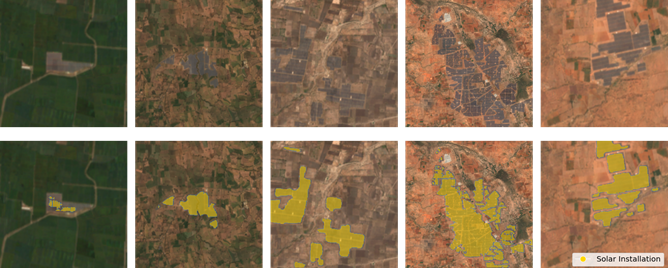

```{r}
#| label: setup
#| pred: python-setup
#| echo: false
library(reticulate)
use_condaenv("stat479_week13_demo", required = TRUE)
```

India is going through a rapid clean energy transition, and many solar power
plants are being constructed. No centralized administrative database describes
when solar farms were established or how they have expanded over time. This
poses a problem for anyone trying to judge the pace of the transition, it's
uniformity across the country, or its ecological impact.

@Ortiz2022 developed a machine learning approach to generate these data from
publicly available satellite imagery. ML is valuable here because it helps scale
the labeling process across the country and to many timepoints.



Specifically, they train a semantic segmentation pipeline, which outputs a
prediction mask labeling every pixel with its probability of belonging to a
solar farm.  The model transforms a tensor of Sentinel-2 imagery taken at a
given location and time into another tensor with the same width and height
containing the predicted probabilities.

In this case study, we study how much spatial context goes into each pixel's
prediction, similar to @malkin2020mining's Figure 1. Specifically, does the
model leverage long-range spatial relationships, or does it have a more limited
receptive field (just the neighboring pixels). If it uses longer-range
information, then it means the predictions require global semantic
representations. If not, then local patch-based statistics may be enough.

## Helper Functions

The helpers in `13-helpers.py` are used for preprocessing and model management,
but aren't directly relevant to any of the interpretability topics of interest.

```{python}
#| label: load-helpers
import importlib.util

spec = importlib.util.spec_from_file_location("helpers", "13-helpers.py")
helpers = importlib.util.module_from_spec(spec)
spec.loader.exec_module(helpers)
```


## Example Prediction

@Ortiz2022 released their results as geojson files containing the boundary
coordinates of predicted solar farms. We use our helpers to load imagery around
an example farm in Karnataka during 2020. You can change `i` to select other
farms in the data. Below we plot the original satellite image and a version with
model predictions overlaid.

```{python}
#| label: load-image
import numpy as np
from shapely import geometry
np.random.seed(4790)

i = 2
geoms = helpers.get_all_geoms("https://raw.githubusercontent.com/krisrs1128/stat479_notes/master/data/karnataka_predictions_polygons_validated_2020.geojson")

side = np.sqrt(geometry.shape(geoms[i]).area)
buffer = max(side * 1.5, 0.001)
image = helpers.get_sentinel_image(geoms[i], buffer=buffer)
```

Next, we load the pretrained model, preprocess the input image, and visualize
the predicted solar farm.

```{python}
#| label: predict-mask
model = helpers.load_model("https://researchlabwuopendata.blob.core.windows.net/solar-farms/checkpoint.pth.tar")
img, x_tensor = helpers.preprocess(image)
pred = helpers.predict_mask(model, x_tensor)

rgb = helpers.scale(img[:, :, [3, 2, 1]], 0, 3000)
helpers.plot_sample_prediction(rgb, pred)
```

## Integrated Gradients

We use integrated gradients to answer the long-range spatial dependence
question. As the response, we use the logit at a random pixel within the
bounding box of a solar farm (re-executing the block will show the result at a
different pixel). Then, we identify which other pixels most strongly influence
that prediction. If many pixels "light up" in the associated saliency map, then
the model uses long-range spatial relationships.

```{python}
#| label: compute-ig
from captum.attr import IntegratedGradients

# define the response
test_row, test_col = helpers.sample_test_points(geoms[i], buffer, img.shape)
def solar_score(inp):
  return model(inp)[:, 1, test_row, test_col]

# get the attributions
ig = IntegratedGradients(solar_score)
attributions = ig.attribute(x_tensor, n_steps=32)
attr = attributions.squeeze(0).detach().numpy() # tensor -> array

# number of large attribution pixels
np.sum(np.abs(attr) > 0.5 * np.max(np.abs(attr)))
```

The saliency map suggests the model predicts using a small patch around the
target pixel (~ 10 - 20 pixels with strong attributions), all close to the
target.  This justifies using deep learning over traditional per-pixel
prediction methods
-- the local context does help. But it also means that very long-range context
isn't really necessary, a finding which has motivated more efficient and
arguably interpretable alternatives, like the epitomes of @malkin2020mining.

```{python}
#| label: plot-ig
heatmap = attr.sum(axis=0)
heatmap = heatmap / np.abs(heatmap).max()
helpers.plot_saliency_comparison(rgb, pred, heatmap, test_row, test_col)
```