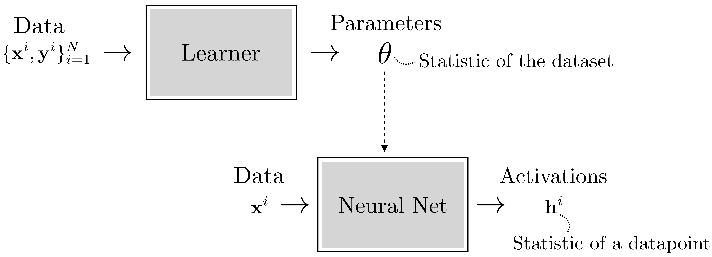
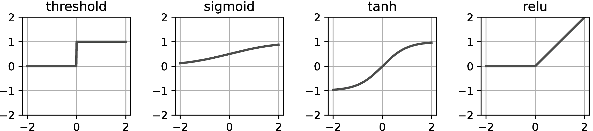

::: {style="display: none;"}
$$
\newcommand{\bs}[1]{\mathbf{#1}}
\newcommand{\reals}{\mathbb{R}}
\newcommand{\widebar}[1]{\overline{#1}}
\newcommand{\E}{\mathbb{E}}
\newcommand{\indic}[1]{\mathbb{1}\left\{{#1}\right\}}
\newcommand{\Earg}[1]{\mathbb{E}\left[{#1}\right]}
\newcommand{\Esubarg}[2]{\mathbb{E}_{#1}\left[{#2}\right]}
$$
:::

<style>
.purple { color: #7458d1ff; } /* pastel purple */
.orange { color: #fca020; } /* pastel orange */
.green { color: #3bbe67ff; } /* pastel green */
.darkblue { color: #4a9ceaff; } /* pastel dark blue */
.pink { color: #ee6ec3ff; } /* pastel pink */
</style>

```{r}
#| label: setup
#| echo: false
library(tidyverse)
library(reticulate)
theme_set(theme_classic() + theme(panel.border= element_rect(fill = NA, linewidth = .5)))
set.seed(2026)
```

```{r}
#| label: python-setup
#| echo: false
# includes the SHAP package. Can install it using,
# > conda env create -f stat479_week6.yml
# where the yaml file is located at: https://github.com/krisrs1128/stat479_notes/blob/master/notes/stat479_week9.yml
#use_condaenv("stat479_week9")
```

_Readings: [1](https://visionbook.mit.edu/neural_nets.html) (sections 12.1 - 12.7, but skip 12.5.2 - 12.5.3), [2](https://docs.pytorch.org/tutorials/beginner/basics/intro.html#learn-the-basics) (optional)_, _[Code](https://github.com/krisrs1128/stat479_notes/blob/master/notes/11-deep_learning_overview.qmd)_

Items marked $^{\dagger}$ are not in the required reading and will not be
tested.  The required reading covers some methods beyond this handout, those
also won't be tested.

## Setup

**Goal.** Given data $\{\left({x_i, y_i}\right)\}_{i = 1}^{N}$, develop a predictor $f$ for $y_{i}$.

  - More importantly, create a generic recipe for learning predictors $f$ that works as soon as we have enough examples $x_i$ and $y_i$, with as little manual effort as possible.

**Requirements.**

- The recipe should apply to a variety of data structures out-of-the-box. See the table below.
- The method must handle highly nonlinear relationships.
- The method must scale to very large $N$.

| Task | $x_i$ | $y_i$ | Example |
|---|---|---| --- | --- |
| Image Classification | image | label | |
| Object Detection | image | label and bounding box | |
| Language Modeling | sequence of words | next word | |
| Sentence Translation | sequence of words | sequence of words | |
| Style Transfer | image | new image | |


**Approach.** We represent data as generic $D$-dimensional tensors and define parameterized modules $f_l(\cdot; \theta_l)$ that process them. Composing these modules creates architectures whose intermediate representations $h_l$ link the inputs $x$ with outputs $y$. Parameters $\theta_l$ are fit by optimizing a loss function.

## Tensor Data Structures

1. To represent very general types of data, we rely on $D$-dimensional tensors
(multidimensional arrays).  Vectors and matrices are special 1 and 2D cases of
tensors. Classes $y_i \{1, \dots, K\}$ can be viewed as one-hot encoded vectors.
Therefore, deep learning immediately applies to the data considered in more
traditional statistics problems.

1. Images and video can be viwed as 3 and 4D tensors, respectively. An RGB image
has dimensions Height $\times$ Width $\times$ Color Channel. A video adds an
extra Time dimension.

1. A document can be viewed as a one-hot encoded tensor with dimensions Vocabulary Size $\times$ Document Length. Notice that since documents can have different lengths, a typical dataset will include many tensors with different sizes.

1. We can stack tensors into "batches" of data points $x_i$. Often, these will
themselves form tensors. For example, a batch of 10 RGB images, each of which is
16 pixels tall and wide, can be written as a $10 \times 16 \times 16 \times 3$
tensor. This property is helpful for accelerating computation. Since GPUs can
perform tensor arithmetic in parallel, we'll be able to optimize over entire
batches very efficiently.

## Perceptrons

1. We'll eventually want flexible modules for mapping tensors from input to
output. Optimizing over those modules will allow us to achieve our prediction
objective.  But for now, let's consider how to map a vecor $x \in \reals^{D}$ to
a binary label $y \in \{0, 1\}$ using the perceptron algorithm (introduced in
the 1950s).

1. A perceptron is a defined as the transformation,
\begin{align*}
x \overrightarrow{f} z \overrightarrow{g} y
\end{align*}
where $f : \reals^D \to \reals$ and $g : \reals \to \reals$ are mappings
\begin{align}
f\left(x\right) &= w^\top x + b \space (\text{linear layer})\\
g\left(z\right) &= \indic{z > 0} \space (\text{activation function}).
\end{align}
This can be viewed as a classifier that $x$ into classes 0 and 1.
Alternatively, it can be seen as a theoretical model of a neuron which computes
a linear combination of inputs and ``activates'' if that combination exceeds a
particular threshold.

1. **$D = 2$**. The parameter $w$ defines a direction in $\reals^{2}$. The set
$\{x: w^\top x = -b\}$ defines the decision boundary between $y = 0$ and $1$. A
few choices of $w$ and $b$ are shown below.

(figures)

_Exercise. Draw the decision boundary when $w = \left(1 0\right)$ and $b = 1$._

_Exercise. TRUE FALSE The decision boundary is parallel with the vector $w^\perp$, the vector perpendicular to $w$._

1. **$D > 2$**. This logic extends to higher dimensions. The parameter $w$
defines a direction in $\reals^{D}$. The perceptron classifies $x$ to group 1 if
$w^\top x > -b$, which geometrically means that $x$ has a ``large enough''
projection onto the direction defined $w$.

1. The perceptron is parameterized by $w \in \reals^{D}$ and $b \in \reals$.
Given data \{x_i, y_i}_{i = 1}^{N}, we can learn $w$ and $b$ so that
$f\left(x_i\right) = y_i$ for as many $i$ as possible. This is accomplished by
solving an optimization problem,
\begin{align*}
\hat{w}, \hat{b} &= \arg \min_{w \in \reals^{D}, b \in \reals} \frac{1}{N}\sum_{i = 1}^{N}L\left(w^\top x_i + b, y_i\right).
\end{align*}
In the original perceptron paper, $L\left(\hat{y}, y\right) := \indic{\hat{y} =
y}$. In general, this is a challenging loss to optimize. It's more common now to
use smooth surrogates, like the cross-entropy loss, because these are amenable
to general purpose stochastic gradient descent algorithmics.

## Multilayer Networks

1. The perceptron does not work well if the data are separated by a nonlinear
boundary. In this case, we can use a variant called a multilayer perceptron (MLP).

1. **$L = 2$ layers.** The simplest MLP has two layers. This includes two vector
processing steps,
\begin{align*}
x \overrightarrow{f_1} z^1 \overrightarrow{g} h^1 \overrightarrow{f_2} z^2 \overrightarrow{g} y
\end{align*}
where $f_l: \reals^{D_{l}} \to \reals^{D_{l + 1}}$ and $g : \reals \to \reals$
are mappings
\begin{align}
f_{l}\left(x\right) &= W_{l}x + b_{l} \space (\text{layer } l \text{ weights and biases})\\
\end{align}
where $W_{l} \in \reals^{D_{l + 1} \times D_{l}}$, $b_{l} \in \reals^{D_{l +
1}}$ and $g$ a nonlinear activation function (it could be the threshold
activation defined above, or other activation layers described below). We have
written $f_{l}(x)$ above, but the function applies to any $D_{l}$-dimensional
input, not necessarily the original input $x$.

1. **$L = 2, D_{1} = 2$ case**. The final prediction can be viewed as a mixture
of $D_{2}$ linear classifiers. The $D_{2}$ classifiers are defined by the rows
of $W_{1}$. The mixing weights are given by $W_{2}$.

Notice that by increasing $D_{1}$, we can learn more nonlinear decision
boundaries between the classes. Each row of the $W_{l}$ is viewed as its own
neuron, sensitive to a particular direction $w_{dl}$.

_Exercise: TRUE FALSE The dataset visualized below can be classified using a two layer MLP._

1. The general MLP can have aribtrarily many layers, and the activation
functions need not be the same across layers,
\begin{align*}
x \overrightarrow{f_1} z^1 \overrightarrow{g_1} h^1 \dots \overrightarrow{f_L} z^L \overrightarrow{g_L} y
\end{align*}

## Parameters and Activations

1. We refer to $z^l$ and $ h^l$ as ``activations'' and $\theta = \{W_{l},
b_{l}\}_{l = 1}^{L}$ as ``parameters.'' We further distinguish between
_pre_activations $z^l$ and _post_activations $h^l$, depending on their position
relative to the activation function.

1. The activations are intermediate tensor representations of a single input
tensor $x$.  The parameters $\theta$ are learned from an entire dataset $\{x_i,
y_i\}$ so that the final layer of representations will generally be highly
predictive of the final tensor $y$.



1. By choosing (almost everywhere) differentiable activations $g$, can learn the
parameters $\theta$ using stochastic gradient descent on an appropriately
defined loss function. This works because our networks are the composition of
(nearly) smooth functions, and their composition remains (nearly) smooth.

## Types of Layers

1. We originally set out to define tensor processing modules that could be
composed to support complex prediction tasks. MLPs already illustrate how
composition can create powerful classifiers out of simple components. We'll next
build up our collection of modules that could be applied in real deep learning
problem solving tasks.

1. **Linear Layers**. A linear layer has the form
\begin{align*}
x_{\text{out}} = f\left(x_{\text{in}}; \theta\right) := W x_{\text{in}} + b
\end{align*}
It has parameters $\theta = \{W, b\}$. As mentioned above, each row of $W$ can
be viewed as its own neuron.

1. **Activation Layers**. Activations are nonlinearities that ensure that the
final neural network output is a nonlinear function of the inputs. They are
necessary because any composition of linear functions is still linear.  Common
choices of nonlinearity are given below. When they are applied to a tensor, they
are applied coordinatewise to each element $x_{\texttt{in}}$ and the output has
the same dimension as the input.

\begin{aligned}
    x_{\text{out}}[i] &=
        \begin{cases}
            1, &\text{if} \quad x_{\text{in}}[i] > 0\\
            0, & \text{otherwise}
        \end{cases} & \quad\quad \triangleleft \quad \text{threshold}\\
    x_{\text{out}}[i] &= \frac{1}{1 + e^{-x_{\text{in}}[i]}} & \quad\quad \triangleleft \quad \text{sigmoid}\\
    x_{\text{out}}[i] &= 2*\text{sigmoid}(2*x_{\text{in}}[i])-1 & \quad\quad \triangleleft \quad \text{tanh}\\
    x_{\text{out}}[i] &= \max(x_{\text{in}}[i],0) & \quad\quad \triangleleft \quad \text{relu}\\
    x_{\text{out}}[i] &=
        \begin{cases}
            \max(x_{\text{in}}[i],0), &\text{if} \quad x_{\text{in}}[i] \geq 0\\
            \alpha\min(x_{\text{in}}[i],0), & \text{otherwise}
        \end{cases} & \quad\quad \triangleleft \quad \texttt{leaky-relu}
\end{aligned}



1. **Normalization Layers**. Both linear and activation layers appeared in MLPs.
A class of layers that appears in almost all modern deep learning techniques,
but not MLPs, are called normalization layers. These are introduced to stabilize
training and guide stochastic gradient descent optimization towards better local
minima of the loss function.

  - Batch Norm. This layer normalizes each coordinate (neuron) of the input activation
  across the current batch.
  $$x_{\text{out}} = \gamma \frac{x_{\text{out}} - \mathbb{E}_{\text{batch}}[x_{\text{in}}]}{\sqrt{\text{Var}_{\text{batch}}[z]}} + \beta$$
  The parameters $\gamma$ and $\beta$ allow each
  - Layer Norm.

**LayerNorm**: Normalize over feature dimension
$$\hat{z} = \frac{z - \mathbb{E}_{\text{features}}[z]}{\sqrt{\text{Var}_{\text{features}}[z]}}$$

1. **Output Layers**

1. There are many other layers that are widely used. They can be used to encode
specific inductive biases (e.g., convolutional networks mimic human vision). The
key point is that they can be mixed and matched like lego blocks. As long as a
layer inputs and outputs a tensor, and as long as it is differentiable with
respect to its learnable parameters, then it can be easily incorporated into
deep learning architectures.

## Learning Representations

## Code Example