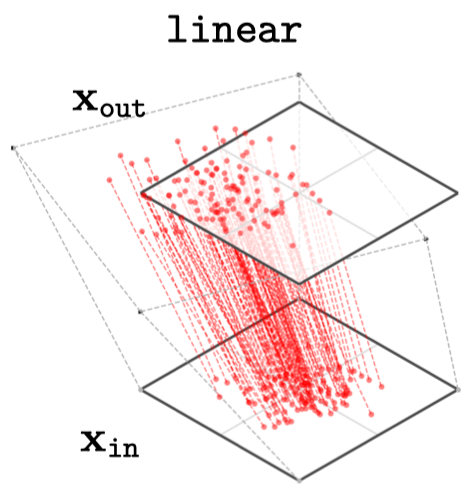
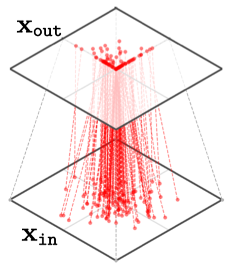
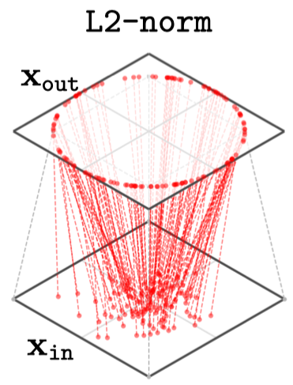
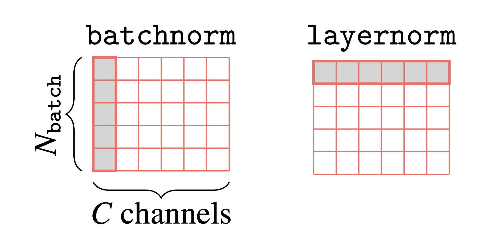
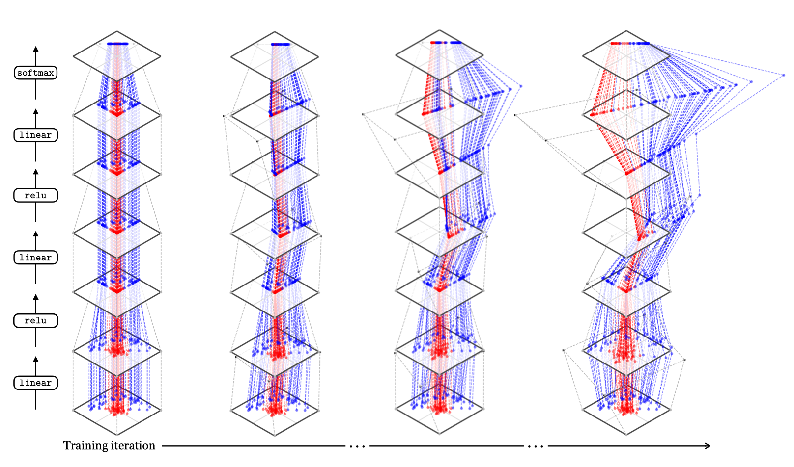
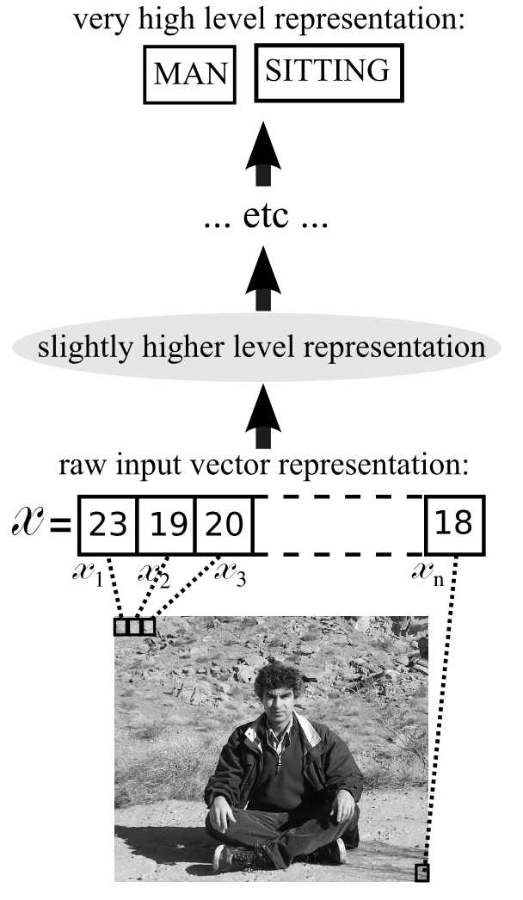

::: {style="display: none;"}
$$
\newcommand{\bs}[1]{\mathbf{#1}}
\newcommand{\reals}{\mathbb{R}}
\newcommand{\widebar}[1]{\overline{#1}}
\newcommand{\E}{\mathbb{E}}
\newcommand{\indic}[1]{\mathbb{1}\left\{{#1}\right\}}
\newcommand{\Earg}[1]{\mathbb{E}\left[{#1}\right]}
\newcommand{\Esubarg}[2]{\mathbb{E}_{#1}\left[{#2}\right]}
$$
:::

<style>
.purple { color: #7458d1ff; } /* pastel purple */
.orange { color: #fca020; } /* pastel orange */
.green { color: #3bbe67ff; } /* pastel green */
.darkblue { color: #4a9ceaff; } /* pastel dark blue */
.pink { color: #ee6ec3ff; } /* pastel pink */
</style>

```{r}
#| label: setup
#| echo: false
library(tidyverse)
library(reticulate)
theme_set(theme_classic() + theme(panel.border= element_rect(fill = NA, linewidth = .5)))
set.seed(2026)
```

```{r}
#| label: python-setup
#| echo: false
# includes the SHAP package. Can install it using,
# > conda env create -f stat479_week6.yml
# where the yaml file is located at: https://github.com/krisrs1128/stat479_notes/blob/master/notes/stat479_week9.yml
#use_condaenv("stat479_week9")
```

_Readings: [1](https://visionbook.mit.edu/neural_nets.html) (sections 12.1 - 12.7, but skip 12.5.2 - 12.5.3), [2](https://docs.pytorch.org/tutorials/beginner/basics/intro.html#learn-the-basics) (optional)_, _[Code](https://github.com/krisrs1128/stat479_notes/blob/master/notes/11-deep_learning_overview.qmd)_

Items marked $^{\dagger}$ are not in the required reading and will not be
tested.

## Setup

**Goal.** Given examples $\{\left({x_i, y_i}\right)\}_{i = 1}^{N}$, learn a
*predictor $f : x \mapsto y$. In fact, the ultimate goal is more ambitious -- we
*want a _generic recipe_ for automatically learning predictors automatically,
*regardless of whether the inputs are tables, images, sentences, ...

**Requirements.** The recipe must,

- Apply out-of-the-box to heterogeneous input/output structures (see table).
- Handle highly nonlinear relationships.
- Scale to large $N$.

| Task | $x_i$ | $y_i$ | Example |
|---|---|---| --- | --- |
| Image Classification | image | label | |
| Object Detection | image | label + bounding box | |
| Language Modeling | sequence of words | next word | |
| Sentence Translation | sequence of words | sequence of words | |
| Style Transfer | image | new image | |

**Approach.** We represent data as $D$-dimensional tensors. Define parameterized
modules $f_l(\cdot; \theta_l)$  and compose them into architectures $f = f_{L}
\circ \dots \circ f_{1}$. Intermediate representations $h_l$ bridge input $x$
*with output $y$. Fit $\theta_l$ by minimizing a loss function.

## Tensor Data Structures

1. We can often represent data as $D$-dimensional tensors (multidimensional
arrays). Vectors and matrices are the $D = 1$ and $D = 2$ cases.

1. This works across many problem contexts. E.g., class labels $y_i \{1, \dots,
K\}$ become one-hot encoded vectors, so tensors capture standard statistics
problems. RGB images are 3D tensors (Height $\times$ Width $\times$ Color
Channel), and video adds a Time axis, so their tensors are 4D. A document is a
Vocabulary $\times$ Document tensor where each word is one-hot encoded. Though,
document lengths vary, so a dataset contains tensors of differnet sizes.

1. We can stack a "batch" of $n$ tensors into a single tensor. For example, 10
RGB images of size $16 \times 16 \times 3$ can be written as a $10 \times 16
\times 16 \times 3$ tensor. This is helpful because GPUs perform tensor
arithmetic in parallel, so batching lets us optimize over many examples at once.

## Perceptrons

1. We want a general recipe for mapping tensors to predictions. This recipe will
be made from composable modules. We start with the simplest case: mapping a
vecor $x \in \reals^D$ to a binary label $y \in \{0, 1\}$ using the perceptron (@Rosenblatt1958).

1. **Definition.** A perceptron combines two transformations:
\begin{align*}
x \xrightarrow{f} z \xrightarrow{g} y
\end{align*}
where
\begin{align}
f\left(x\right) &= w^\top x + b \space (\text{linear layer})\\
g\left(z\right) &= \indic{z > 0} \space (\text{activation}).
\end{align}
In other words, take a linear combination of inputs and threshold. The result is
a binary classifier. Historically, this was viewed as a model of a neuron that
"fires" when its inputs reach a threshold.

1. **$D = 2$**. The vector $w$ defines a direction in $\reals^{2}$. The set
$\{x: w^\top x = -b\}$ is the decision boundary between classes. Changing
$w$ rotates the boundary and changing $b$ translates it.
few choices of $w$ and $b$ are shown below.

   _Exercise. Draw the decision boundary when $w = \begin{bmatrix}1 & 0\end{bmatrix}$ and $b = 1$._

   _Exercise. TRUE FALSE The decision boundary is parallel to $w^\perp$, the vector perpendicular to $w$._

1. **$D > 2$**. This logic holds in higher dimensions. The perceptron assigns $y
= 1$ whenever $x$ has a large enough projection onto $w$, i.e., $w^\top x > -b$.
The decision boundary is now a $D - 1$-dimensional hyperplane.

1. Given $\{x_i, y_i\}_{i = 1}^{N}$, we learn $w$ and $b$ by solving,
\begin{align*}
\hat{w}, \hat{b} &= \arg \min_{w \in \reals^{D}, b \in \reals} \frac{1}{N}\sum_{i = 1}^{N}L\left(w^\top x_i + b, y_i\right).
\end{align*}
@Rosenblatt1958 used $L\left(\hat{y}, y\right) := \indic{\hat{y} \neq y}$, a
nonconvex 0-1 loss which is hard to optimize. Modern approaches replace this
loss with smooth surrogates, like cross-entropy, which are amenable to
gradient-based optimization.

## Multilayer Networks

1. The perceptron can only draw linear boundaries. To handle nonlinear
classification, we compose multiple layers, giving the multilayer perceptron
(MLP).

1. **Two Layers ($L = 2$).** The simplest MLP alternates linear maps with nonlinear
activations,
\begin{align*}
x \xrightarrow{f_1} z^1 \xrightarrow{g} h^1 \xrightarrow{f_2} z^2 \xrightarrow{g} \hat{y}
\end{align*}
where each linear layer is,
are mappings
\begin{align}
f_{l}\left(v\right) &= W_{l}v + b_{l} \space (\text{layer } l \text{ weights and biases})\\
\end{align}
where $W_{l} \in \reals^{D_{l + 1} \times D_{l}}$, $b_{l} \in \reals^{D_{l +
1}}$ and $g$ is a nonlinear activation function applied elementwise (the
threshold from before or alternatives defined later). Note that the argument is
a generic $v \in \reals^{D_{l}}$. At the first layer, this is $x$, but at deeper
layers, it is the current hidden representation $h^{l - 1}$.

1. **Geometric interpretation ($L = 2, D_{1} = 2)$**. Each row of $W_1$ defines
a linear classifier in the input space $x$. The second layer $W_2$ mixes these
classifiers. This allows for piecewise linear decision boundaries, which are
more flexible than the ordinary perceptron. Increasing $D_2$ (the number of rows
of $W_1$) adds more classifiers to the mixture, allowing more complex
boundaries.

    _Exercise: TRUE FALSE The dataset visualized below can be classified by a two layer MLP._

1. **Deeper models**. The $L$-layer MLP repeats the pattern,
\begin{align*}
x \xrightarrow{f_1} z^1 \xrightarrow{g} h^1 \xrightarrow{f_2} \dots \xrightarrow{g} h^{L - 1} \xrightarrow{\text{output layer}} \hat{y}
\end{align*}
so that we can continue mixing increasingly complex classifiers.

## Parameters and Activations

1. There are two types of quantities involved with a deep learning model, and they each play a different role in learning and prediction.

  - **Parameters** $\theta = \{W_l, b_l\}_{l = 1}^{L}$ are learned from the full
  data $\{x_i, y_i\}$. They are shared across all inputs.
  - **Activations** are intermediate representations of a singel input $x$ as it
  travels through the network. We distinguish _pre_activations $z^l =
  f^l\left(h^{l - 1}\right)$ from _post_activations $h^l = g(z^l)$ depending on
  whether the nonlinearity $g$ has been applied.

  Training adjusts $\theta$ so that the final representations $h^{L - 1}$ are
  predictive of $y$.

    {width=70%}

1. If $g$ is differentiable (almost everywhere), the entire network $f = f_{L}
\circ g \circ \dots \circ g \circ f_{1}$ is a composition of nearly smooth
smooth functions. The result remains nearly smooth, meaning we can compute
$\nabla_{\theta} L$ and minimize the loss using stochastic gradient descent.

## Types of Layers

1. We originally set out to build composable tensor processing modules. The MLP
illustrates the principle. We next catalog modules used in practice.

1. **Linear layers**. The map $x_{\text{out}} = f\left(x_{\text{in}};
\theta\right) := W x_{\text{in}} + b$, which has parameters $\theta = \{W, b\}$.
Each row of $W$ acts as a single neuron, activating on a subset of the input
space.

    {width=30%}

1. **Activation layers**. Activations are nonlinearities that ensure that deep
network can represent many types of functions. The composition of linear layers
is still linear, so without these activations, even a deep composition would
collapse to a single linear map.
Common choices are given below, note they are applied elementwise,

   \begin{aligned}
   x_{\text{out}}[d] &= \begin{cases} 1, &\text{if} \quad x_{\text{in}}[d] > 0\\ 0, & \text{otherwise} \end{cases} & \quad\quad \triangleleft \quad \text{threshold}\\
   x_{\text{out}}[d] &= \frac{1}{1 + e^{-x_{\text{in}}[d]}} & \quad\quad \triangleleft \quad \text{sigmoid}\\
   x_{\text{out}}[d] &= 2\times \text{sigmoid}(2x_{\text{in}}[d])-1 & \quad\quad \triangleleft \quad \text{tanh}\\
   x_{\text{out}}[d] &= \max(x_{\text{in}}[d],0) & \quad\quad \triangleleft \quad \text{ReLu}\\
   \end{aligned}

   

   _Exercise. The visualization below applies one of these activations to 2D inputs $x_{\text{in}}$. Which one?_

   {width=30%}

1. **Normalization Layers**. These do not appear in classical MLPs but are
common in modern architectures. Their role is to stabilize training dynamics and
improve the loss landscape for stochastic gradient descent.

    - **Batch Normalization**. Normalize each coordinate $d$ across a batch of $B$ inputs,
    $$\mu_d = \frac{1}{B} \sum_{b=1}^{B} x_{\text{in}}^{(b)}[d], \qquad \sigma_d^2 = \frac{1}{B} \sum_{b=1}^{B} \left(x_{\text{in}}^{(b)}[d] - \mu_d\right)^2$$
     $$x_{\text{out}}^{(b)}[d] = \gamma \frac{x_{\text{in}}^{(b)}[d] - \mu_d}{\sigma_d} + \beta$$
    The tensor dimension $D_{\text{in}}$ remain unchanged after normalization.
    The learnable parameters $\gamma \in \reals, \beta \in D_{\text{in}}$ let
    each neuron have its own scale and shift, which controls the magnitude and
    frequency of the later activations. Note that $\mu_d$ and $\sigma_d$ couple
    samples within a batch, creating a subtle dependence.
    - **$\ell^2$ normalization**. Project each input onto the
    $\ell^2$ unit sphere,
    \begin{aligned}
    x_{\text{out}}[d] = \frac{x_{\text{in}}[d]}{\sqrt{\sum_{d' = 1}^{D} x^{2}_{\text{in}[d']}}}
    \end{aligned}
    This has no learnable parameters and no batch dependence.

    {width=30%}

    - **Layer Norm**. Like $\ell^2$ normalization, but both centers scales the $D$ coordinates of a single input,
    its neurons,
    \begin{aligned}
    \mu &= \frac{1}{D} \sum_{d=1}^D x_{\text{in}}[d]\\
    \sigma^2 &= \frac{1}{D} \sum_{d=1}^D \left(x_{\text{in}}[d] - \mu\right)^2\\
    x_{\text{out}}[d] &= \gamma \frac{x_{\text{in}}[d] - \mu}{\sigma} + \beta
    \end{aligned}
    This is like $\ell^2$ normalization, processing each sample independently
    without coupling across batches. Like batch normalization, the learnable
    $\gamma_d$ and $\beta_d$ preserve flexibility.

    {width=60%}


1. **Output Layers**. These convert internal representations $h^l$ into a form
matched to the prediction target $y$.

    - Softmax Layer. Maps an activation to a probability distribution over $K$ classes,
    \begin{aligned}
      x_{\text{out}}[d] &= \frac{e^{-\tau x_{\text{in}}[d]}}
        {\sum_{k=1}^K e^{-\tau x_{\text{in}}[k]}}
    \end{aligned}
    The output can support either prediction (argmax $\to$ class label) or
    sampling (draw from the distribution of plausible outputs). The temperature
    $\tau > 0$ controls the concentration of the distribution: large $\tau$
    sharpen the distribution towards the most probable class, small $\tau$
    flatten it towards the uniform, resulting in more diverse samples.

    - Image rescaling For image generation, map activations to the pixel range
    $\left[0, 255\right]$
    \begin{aligned}
      x_{\text{out}}[d] &= 255*\text{sigmoid}(x_{\text{in}}[d])
    \end{aligned}

1. Many other layers exit, like convolutional, gated recurrent unit, and
transformer layers. They can be used to encode specific inductive biases (e.g.,
convolutions pool local spatial features). The main idea is that any layer that
takes a tensor in, produces a tensor out, and is differentiable with respect to
learnable parameters can be composed into a deep learning architecture. Layers
are interchangeable parts, like lego blocks.

## Learning Representations

1. The reading lists five reasons for deep learning's success. Summarizing,

    a. High capacity -- large networks can learn flexible functions.
    b. Differentiable -- parameters can be optimized out-of-the-box with stochastic gradient descent.
    c. Good inductive biases -- architectures reflect real-world structure.
    d. Hardware friendly -- tensor operations parallelize on GPUs.
    e. Learned abstractions -- Networks automatically learn useful intermediate representations.

1. Point (a) also makes deep networks difficult to interpret. We can't
understand what a network will do with a new input $x$ by inspecting $theta$
directly. We have to run the computation.

1. $\^dagger$ Property (e) deserves closer consideration. Each layer transforms
an input, and by the final layer, the representation $h^{L - 1}$ should make
predicting $y$ straightforward. In the toy example below, what requires a
nonlinear boundary in the input space $x$ becomes linearly separable by $h^{L -
1}$.

    

1. $^\dagger$ More amazingly, deeper layers learn progressively more abstract
patterns. E.g., in image classification, they learn pixels $\to$ edges $\to$
parts $\to$ objects. Traditionally, abstract features were hand-engineered
(e.g., SIFT descriptors in computer vision @Lowe1999). That networks discover
them from data alone is one fo the central phenomena associated with deep
learning, and we will spend several weeks studying exactly what "learned
abstraction" really means.

    {width=40%}

## Code Example