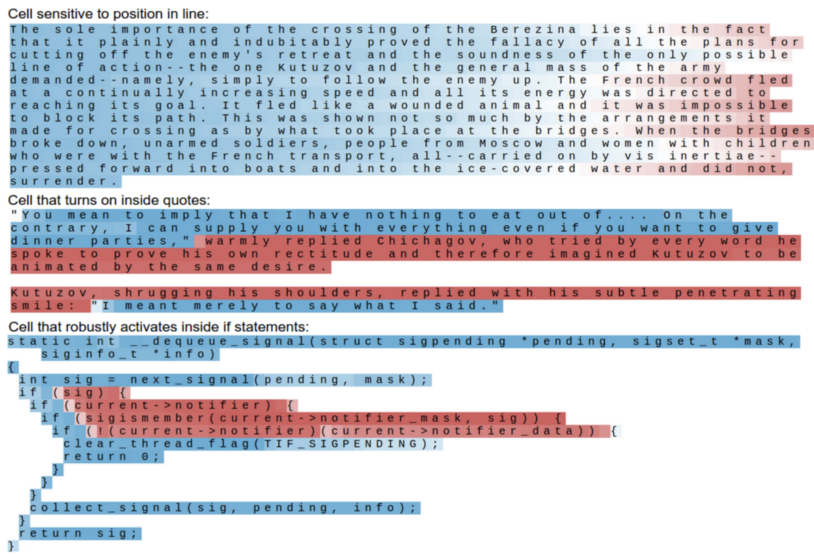
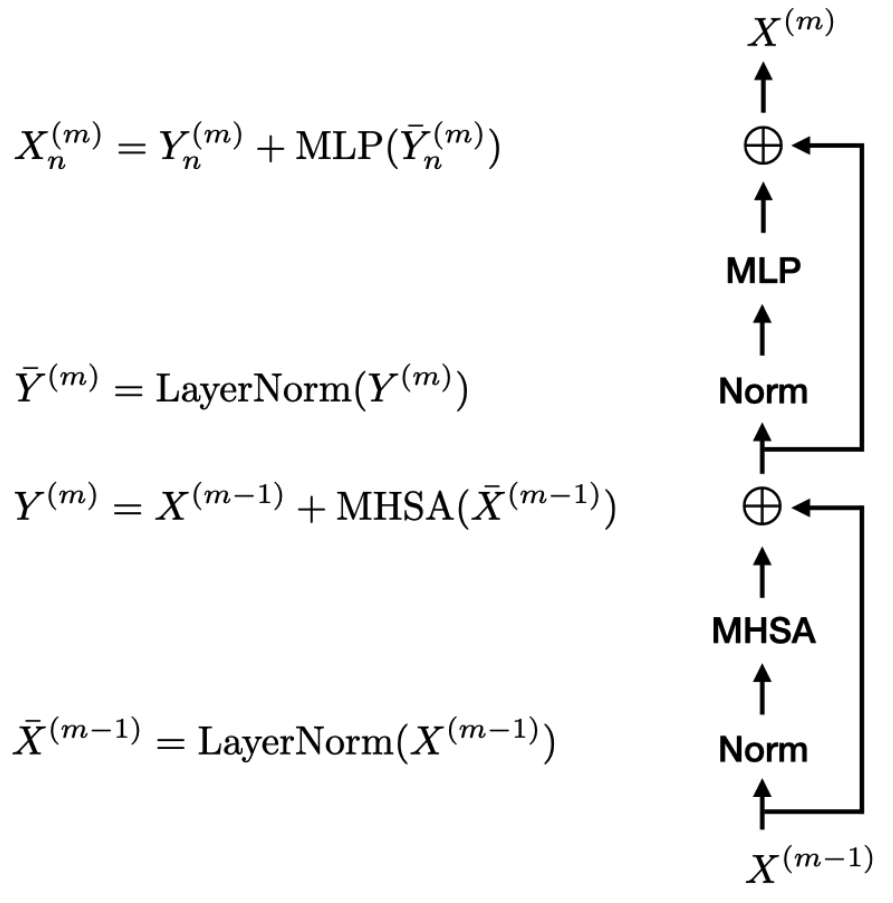

::: {style="display: none;"}
$$
\newcommand{\bs}[1]{\mathbf{#1}}
\newcommand{\reals}{\mathbb{R}}
\newcommand{\widebar}[1]{\overline{#1}}
\newcommand{\E}{\mathbb{E}}
\newcommand{\indic}[1]{\mathbb{1}\left\{{#1}\right\}}
\newcommand{\Earg}[1]{\mathbb{E}\left[{#1}\right]}
\newcommand{\Esubarg}[2]{\mathbb{E}_{#1}\left[{#2}\right]}
$$
:::

<style>
.purple { color: #7458d1ff; } /* pastel purple */
.orange { color: #fca020; } /* pastel orange */
.green { color: #3bbe67ff; } /* pastel green */
.darkblue { color: #4a9ceaff; } /* pastel dark blue */
.pink { color: #ee6ec3ff; } /* pastel pink */
</style>

```{r}
#| label: setup
#| echo: false
library(tidyverse)
library(reticulate)
theme_set(theme_classic() + theme(panel.border= element_rect(fill = NA, linewidth = .5)))
set.seed(2026)
```

```{r}
#| label: python-setup
#| echo: false
# includes torch and transformers. Can install it using,
# > conda env create -f stat479_week6.yml
# where the yaml file is located at: https://github.com/krisrs1128/stat479_notes/blob/master/notes/stat479_week12.yml
use_condaenv("stat479_week12")
```

_[Reading](https://arxiv.org/abs/2304.10557)_, _[Code](https://github.com/krisrs1128/stat479_notes/blob/master/notes/12-transformers_handout.qmd)_

Items marked $^{\dagger}$ are not in the required reading and will not be
tested. The required reading covers some methods beyond this handout, those also
won't be tested.

## Setup

1. **Definition**. We view a single sample as a sequence of $N$ tokens, $x_{n}
\in \reals^{D}$. For example,

    - In language, we represent a document as a sequence of $N$ words, mapping each word to a one-hot vector $e(\text{word}) \in \reals^{V}$, where $V$ is the vocabulary size,

   ```{python}
#| label: tokenize-text
from transformers import AutoTokenizer

tokenizer = AutoTokenizer.from_pretrained("gpt2")
tokens = tokenizer(" to be or not to be")
tokens["input_ids"]
   ```

    To keep the dimensionality $D$ of the tokens manageable, we usually apply an
    initial linear transformation $x_{n}\left(\text{word}\right) = W
    e\left(\text{word}\right)$ where $W \in \reals^{D \times V}$ and $D \ll V$.

   ```{python}
#| label: word-embedding
import torch

# V = 50257 words, D = 8 dimensions
embed = torch.nn.Embedding(num_embeddings=50257, embedding_dim=16)
X = embed(torch.LongTensor(tokens["input_ids"])).T
torch.round(X, decimals=2) # notice columns 1 - 2 match 5 - 6
   ```

    - In vision, we represent an image as a sequence of $N$ image patches. Here $D = W^{\text{patch}} \times H^{\text{patch}}$, the total number of pixels in each patch.

1. **Goal**. Map a token sequence $X \in \reals^{D \times N}$ to a representation useful for prediction. Specifically, we want a
map parameterized by weights $\theta_{m}$,
$f_{\theta_{m}}: \reals^{D \times N} \to \reals^{D \times N}$,
\begin{align*}
  X^{m} = f_{\theta_{m}}(X^{m - 1})
\end{align*}
that can be applied recursively within a deep model, similarly to the ``linear
layer + nonlinear activation'' block used in MLPs.

1. **Requirements**

    - The map must act on the full sequence simultaneously, unlike an MLP, which processes one vector at a time.

    - The map must capture long-range dependence. It must ``remember'' information
    from earlier in the sequence. This is unlike GPs and traditional statistical
    models.

    

1. **Approach**. We compose transformer blocks $f_{\theta_1}, \dots, f_{\theta_M}$ to gradually refine the sequence representation,
\begin{align*}
X^{0} \xrightarrow{f_{\theta_{1}}} X^{1} \xrightarrow{f_{\theta_{2}}} \dots \xrightarrow{f_{\theta_{M}}} X^{M}
\end{align*}
Like in MLPs, the parameters $\theta_{1}, \dots, \theta_{M}$ will be optimized
to accomplish some downstream task. We omit optimization details, since our
focus is interpretability.

1. **Preview**. Each block $f_{\theta_{m}}$ will have the form,

    {width=60%}

    We've seen MLP and LayerNorm steps before, though we'll consider why they are
    helpful in this context. A critical, new component is the multihead
    self-attention operation (MHSA). This is what allows the transformation to
    learn long-range dependence.

    Everything below the first $\bigoplus$ is Stage 1 and everything above is
    Stage 2.

## Stage 1: Attention across sequence

1. **Attention**. In layer $m$, we want a nonnegative matrix $A^{m} \in
\reals^{N \times N}$ whose columns sum to one. Column $n$ is viewed as a
distribution over input tokens $n'$ that are relevant to token $n$. Informally,
token $n$ attends to token $n'$ according to the weight $A_{nn'}^{m}$.

1. If we knew $A^{m}$, we could compute,

   \begin{align*}
   Y^{m} = X^{m - 1}A^{m}
   \end{align*}

   and call it the output of stage 1. This sets the $n^{th}$ column of $Y^{m}$
   to be a convex combination of columns of $X^{m - 1}$ where the mixing weights
   come from $A^{m}$. There are unfortunately two problems,

    - Where do the attention weights come from?
    - This operation can select which tokens to mix, but not what information to
    extract from them. This will be addressed by the values matrix $V_{h}$ below.

    We'll resolve both issues step-by-step. To reduce the notational clutter,
    we'll suppress the $m$ superscripts for now -- the remainder of the note is
    focusing on a single layer $m$.

1. **MHSA (attempt 1: position-only)**. A first attempt would be to define
similarity according to the distance between tokens. For example,

   \begin{align*}
   A_{nn'} &= \frac{\exp{\left|n - n'\right|}}{\sum_{n' = 1}^{N} \exp{\left|n - n'\right|}}
   \end{align*}
   This can't learn long-range dependence since weights decay with distance.

1. **MHSA (attempt 2: content-based similarity)**. We use the tokens themselves
to define attention. Tokens with similar representations attend to one another.
We can measure this similarity with inner products $x_{n}^{\top} x_{n'}$, using
a softmax so that the columns of $A$ are nonnegative and sum to one,
\begin{align*}
  A_{nn'} &= \frac{\exp{x_{n}^\top x_{n^{\prime}}}}{\sum_{n' = 1}^{N} \exp{x_{n}^\top x_{n^{\prime}}}}
\end{align*}
Similarity is now content (not position) based, so long-range dependence is
possible.

   ```{python}
#| label: basic-attention
A = torch.softmax(X.T @ X, dim=0)
   ```

   ```{python}
#| label: attention-heatmap
#| echo: false
import altair as alt
import pandas as pd

words = tokenizer.convert_ids_to_tokens(tokens["input_ids"])
words = [f"{w.replace('Ġ', '')}_{i}" for i, w in enumerate(words)]

A = torch.softmax(X.T @ X, dim=0)

df = pd.DataFrame(A.detach().numpy(), columns=words, index=words)
df = df.reset_index(names="token_n").melt(id_vars="token_n", var_name="token_n_prime", value_name="weight")

alt.Chart(df).mark_rect().encode(
    x=alt.X("token_n_prime:N", title="n'", sort=words),
    y=alt.Y("token_n:N", title="n", sort=words),
    color=alt.Color("weight:Q", scale=alt.Scale(scheme="blues"))
).properties(width=200, height=200)
   ```

1. **MHSA (attempt 3: subspace-specific similarities)**. This inner product imposes a single notion of similarity. In reality, multiple types exist. For example, "scale" and "arpeggio" might be similar in the sense
of both being musical terms, while "scale" and "fish" might be similar in
the sense of being a part of the animal. To this end, we project the tokens
$x_{n}$ onto a subspace spanned by the $M < D$ rows of $U \in \reals^{M \times
D}$. The projected coordinates are given by $Ux_{n}$, and their associated
similarity is,
\begin{align*}
  A_{nn'} &= \frac{\exp{\left(Ux_{n}\right)^\top Ux_{n^{\prime}}}}{\sum_{n' = 1}^{N}\exp{\left(Ux_{n}\right)^\top Ux_{n^{\prime}}}}
\end{align*}

1. To illustrate, consider a representation where the first and last four
dimensions reflect animal and music related meanings, respectively. Scale has
high values in both. Subspace-specific $U$'s will be able to learn different
types of similarity. In a real model, $U$ is learned, not set manually, but the
idea is the same -- each projection induces its own similarity

   ```{python}
#| label: subspace-setup
#| echo: false
# Hand-crafted 6-token embeddings, D=8
import torch
import pandas as pd
import altair as alt

def attention_df(A, words, label):
    df = pd.DataFrame(A.detach().numpy(), columns=words, index=words)
    df = df.reset_index(names="token_n").melt(id_vars="token_n", var_name="token_n_prime", value_name="weight")
    df["projection"] = label
    return df

U_animal = torch.zeros(4, 8)
U_animal[:, :4] = torch.eye(4)

U_music = torch.zeros(4, 8)
U_music[:, 4:] = torch.eye(4)
   ```

   ```{python}
#| label: subspace-attention
test_words = ["scale", "fish", "arpeggio", "music", "random", "other"]
X = torch.tensor([
    [0.8, 0.9, 0.1, 0.7, 0.7, 0.8, 0.1, 0.2],  # scale: both
    [0.9, 1.0, 0.0, 0.8, 0.0, 0.1, 0.0, 0.1],  # fish: animal only
    [0.0, 0.1, 0.0, 0.0, 0.9, 1.0, 0.8, 0.9],  # arpeggio: music only
    [0.1, 0.0, 0.1, 0.1, 0.8, 0.9, 0.9, 1.0],  # music: music only
    [0.1, 0.2, 0.1, 0.0, 0.1, 0.0, 0.2, 0.1],  # random: low on both
    [0.0, 0.1, 0.2, 0.1, 0.0, 0.2, 0.1, 0.0],  # other: low on both
]).T

# two attention matrices
A_animal = torch.softmax((U_animal @ X).T @ (U_animal @ X), dim=0)
A_music = torch.softmax((U_music @ X).T @ (U_music @ X), dim=0)
   ```

   ```{python}
#| label: subspace-heatmap
#| echo: false
words_indexed = [f"{w}_{i}" for i, w in enumerate(test_words)]
df = pd.concat([
    attention_df(A_animal, words_indexed, "Animal-based U)"),
    attention_df(A_music, words_indexed, "Music-based U)")
])

alt.Chart(df).mark_rect().encode(
    x=alt.X("token_n_prime:N", title="n'", sort=words_indexed),
    y=alt.Y("token_n:N", title="n", sort=words_indexed),
    color=alt.Color("weight:Q", scale=alt.Scale(scheme="blues"))
).properties(width=300, height=300).facet(
    column=alt.Column("projection:N", title=None)
)
   ```

1. **MHSA (attempt 4: asymmetry)**. With a single $U$, similarity is symmetric $A_{nn'} = A_{n'n}$. Separate projections $U_k, U_q$ break this symmetry,
\begin{align*}
  A_{nn'} &= \frac{\exp{\left(U_{k}x_{n}\right)^\top U_{q}x_{n^{\prime}}}}{\sum_{n' = 1}^{N}\exp{\left(U_{k}x_{n}\right)^\top U_{q}x_{n^{\prime}}}}
\end{align*}
In the literature, the quantities $U_{q}x$ and $U_{k}x$ are called queries
and keys, respectively.

   Token $n'$ asks the query $U_q x_{n'}$ and token $n$ presents a key $U_k
   x_n$. Attention is high when the key aligns with the query. In pseudocode,
   this is,

   ```{python}
#| label: asymmetric-attention
Uq = torch.randn(6, 8)
Uk = torch.randn(6, 8)

A_asym = torch.softmax((Uk @ X).T @ (Uq @ X), dim=0)
   ```

   ```{python}
#| label: asymmetric-heatmap
#| echo: false
alt.Chart(attention_df(A_asym, test_words, "Asymmetric attention")).mark_rect().encode(
    x=alt.X("token_n_prime:N", title="n'", sort=words),
    y=alt.Y("token_n:N", title="n", sort=words),
    color=alt.Color("weight:Q", scale=alt.Scale(scheme="blues"))
).properties(width=300, height=300).facet(
    column=alt.Column("projection:N", title=None)
)
   ```

1. **MHSA** Finally, we can consider many keys and queries. This
can capture the different senses of "scale" above. Specifically, for each layer
$m$, we define $H$ matrices,
\begin{align*}
U_{kh} \in \reals^{M \times D} \qquad U_{qh} \in \reals^{M \times D}
\end{align*}
which allows us to create $H$ different versions of the attention matrices
$A_{h}$,
\begin{align*}
\left[A_{h}\right]_{nn'} &= \frac{\left(U_{kh}x_{n}\right)^\top\left(U_{qh}x_{n'}\right)}{\sum_{n' = 1}^{N}\left(U_{kh}x_{n}\right)^\top\left(U_{qh}x_{n'}\right)}
\end{align*}
Then, instead of simply using $Y^{m} = X^{m - 1}A^{m}$ like we defined above, we
consider
\begin{align*}
Y^{m} = \sum_{h = 1}^{H} V_{h}^{m} X^{m - 1}A_{h}^{m}
\end{align*}
where $V_{h}^{m} \in \reals^{D \times D}$ is a linear transformation of the
attention-mixed input. Each head $h$ can specialize. Its $U_{kh}, U_{qh}$ find
which tokens are relevant under head $h$'s notion of similarity, and its $V_h$
determines what to extract from those tokens.

1. In the literature $V_{h}$ are called "values" -- when the query matches a key
according to the similarities $A_{h}$, we return the values $V_{h}^{m}X^{m -
1}$. $A_h^m$ selects which tokens to mix and $V_h^m$ selects what to extract from them.
For example, in the sentence "The movie was not good," the word "good" might
attend most closely to the word "not." The token $x_{n'}^{m}$ representing "not"
might capture many aspects of this word (e.g., it is a short word, it is common,
...) besides the part that's relevant (it negates what follows). $V$ can learn
to extract the negation aspect and suppress the rest.

1. To summarize, we have parameters $U_{qh}^{m}, U_{kh}^{m}, V_{h}^{m}$ for each
layer $m$ which learn the similarities between pairs of tokens and linearly
transforms the representations $X^{m - 1}$ in layer $m - 1$ into $X^{m}$ at
layer $m$.

## Stage 2: MLP across features

1. Stage 1 learns dependence across tokens
but treats each feature separately. Every row of $X^{m - 1}$ is mixed
by the same weights $A^m$. Stage 2 applies a per-token nonlinear
transformation that learns interactions across feature dimensions.

1. Specifically, Stage 1 returns,
$$Y^m = X^{m-1} + \text{MHSA}(\bar{X}^{m-1})$$
where $\bar{X}^{m-1} = \text{LayerNorm}(X^{m-1})$
centers/scales each token's representation (with learned shift and scale
parameters, as discussed in the last note). Stage 2 then modifies each token's
features,
$$x_n^m = y_n^m + \text{MLP}(\bar{y}_n^m)$$
where we similarly define the normalization $\bar{Y}^m = \text{LayerNorm}(Y^m)$
and use lower case symbols to extract the $n^{th}$ columns of $X^m$ and $Y^m$. Expressing this as pseudocode,

   ```{python}
#| label: transformer-block
#| eval: false
# Stage 1: mix across tokens
X_norm = layer_norm(X)
Y = X + mhsa(X_norm)

# Stage 2: mix across features
Y_norm = layer_norm(Y)
X_next = Y + mlp(Y_norm)
   ```

1. Both stages use residual connections, meaning that output = input +
correction.  Notice only the correction applies LayerNorm. The reason for using
these connections is that, at initialization, the MLP and MHSA weights are
small, so both corrections are near zero and the entire block acts as
essentially the identity. Training gradually learns the corrections. This is
reminiscent of boosting, where each training step refines the residuals of the
current fit.

1. Putting everything together, we arrive again at Figure 7 from the reading,

    {width=60%}

   This is the map $f_{\theta_{m}} : \reals^{D \times N} \to \reals^{D \times N}$ from the setup, wiht parameters $\theta_m$ containing hte query, key, and value matrices from MHSA, the MLP weights, adn teh scale/shift parameters for the two LayerNorm steps. Stacking $M$ of these blocks gives a full transformer model.

   \begin{align*}
   X^0 \xrightarrow{f_{\theta_1}} X^1 \xrightarrow{f_{\theta_2}} \cdots \xrightarrow{f_{\theta_M}} X^M
   \end{align*}

   Each layer enriches token representations by sharing information across
   tokens (Stage 1) and features (Stage 2). Stacking layers allows the
   representations to be mixed again so that higher-level, indirect
   relationships can emerge.

## Code Example

1. Here's a small example inspecting the attention weights from a pretrained
model, downloaded from the HuggingFace repository of pretrained models. The
`tokenizer` object converts free character strings into sequences of tokens.

   ```{python}
#| echo: false
#| label: handle-logging
from transformers import logging
from huggingface_hub.utils import disable_progress_bars
logging.set_verbosity_error()
logging.disable_progress_bar()
disable_progress_bars()
   ```

   ```{python}
#| label: bert-sentiment
from transformers import AutoTokenizer, AutoModelForSequenceClassification
import torch

tokenizer = AutoTokenizer.from_pretrained("textattack/bert-base-uncased-SST-2")
model = AutoModelForSequenceClassification.from_pretrained(
    "textattack/bert-base-uncased-SST-2",
    attn_implementation="eager"
)
   ```

   The model behaves like we expect on a few made up examples. The two columns
   of logits correspond to whether it was a positive or negative sentiment
   review.

   ```{python}
#| label: example-classification
reviews = [
    "terrible, 1 star",
    "great, changed my life"
]
inputs = tokenizer(reviews, return_tensors="pt", padding=True)
logits = model(**inputs).logits
torch.softmax(logits, dim=1)
   ```

1. To understand the attention matrix, we can use the `.attentions` attribute in
the trained model. The way these matrices are stored will differ from model to
model. But conceptually they will always include a collection of heads that
reweight the $n$ sequence inputs to one another.

   ```{python}
#| label: bert-attentions
text = "A wonderful little production. The filming technique is very unassuming, old time BBC fashion and gives a comforting, and sometimes discomforting, sense of realism to the entire piece."
inputs = tokenizer(text, return_tensors="pt")
outputs = model(**inputs, output_attentions=True)
A = outputs.attentions[10][0, 11].detach()  # layer 10, batch 0, head 11
   ```

   ```{python}
#| label: bert-heatmap
#| echo: false
#| eval: true
words = tokenizer.convert_ids_to_tokens(inputs["input_ids"][0])
words_indexed = [f"{w}_{i}" for i, w in enumerate(words)]
df = attention_df(A, words_indexed, "Layer 0, Head 0")

alt.Chart(df).mark_rect().encode(
    x=alt.X("token_n_prime:N", title="n'", sort=words_indexed),
    y=alt.Y("token_n:N", title="n", sort=words_indexed),
    color=alt.Color("weight:Q", scale=alt.Scale(scheme="blues"))
).properties(width=350, height=350)
   ```

1. Just out of interest, let's study some of the hidden states from this model.
The function below loops over the input reviews, converts each into a sequence
of tokens, and extracts the final layer's representation $X^{M}$.

   ```{python}
#| label: embeddings-function
import numpy as np
import pandas as pd

def hidden_states(reviews, tokenizer, model, batch_size=16):
    embeddings = []
    model.eval()
    with torch.no_grad():
        for i in range(0, len(reviews), batch_size):
            # get current review
            batch = list(reviews[i:i + batch_size])
            inputs = tokenizer(batch, return_tensors="pt", padding=True, truncation=True, max_length=512)

            # get hidden states
            outputs = model(**inputs, output_hidden_states=True)
            embeddings.append(outputs.hidden_states[-1][:, 0, :].numpy())
    return np.vstack(embeddings)
   ```

   We next apply that function to a random sample of 300 reviews. We've hidden the
code, but we then run PCA to organize those reviews in a 2D plot.
   ```{python}
#| label: run-embeddings
imdb = pd.read_csv("../data/imdb.csv").sample(300, random_state=2026)
h = hidden_states(imdb["review"].tolist(), tokenizer, model)
   ```

   ```{python}
#| label: imdb-pca
#| echo: false
from sklearn.decomposition import PCA
coords = PCA(n_components=2).fit_transform(h)
df_pca = pd.DataFrame({
    "PC1": coords[:, 0],
    "PC2": coords[:, 1],
    "sentiment": imdb["sentiment"].values,
    "review": [r[:300] + "..." for r in imdb["review"].values]
})

alt.Chart(df_pca).mark_circle(size=40, opacity=0.6).encode(
    x=alt.X("PC1:Q"),
    y=alt.Y("PC2:Q"),
    color=alt.Color("sentiment:N", scale=alt.Scale(range=["#b675ad", "#3b5a7c"])),
    tooltip=["sentiment:N", "review:N"]
).properties(width=400, height=300)
   ```