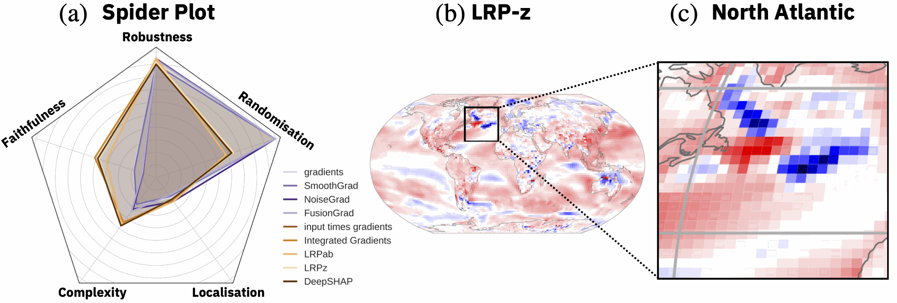
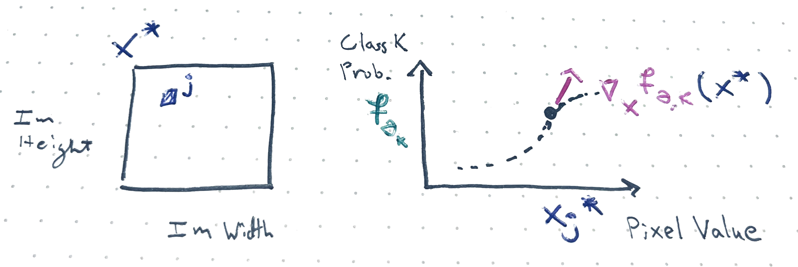
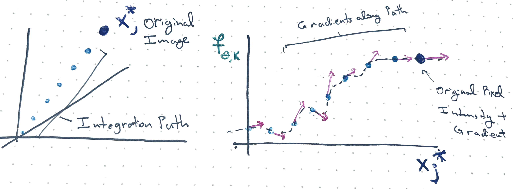
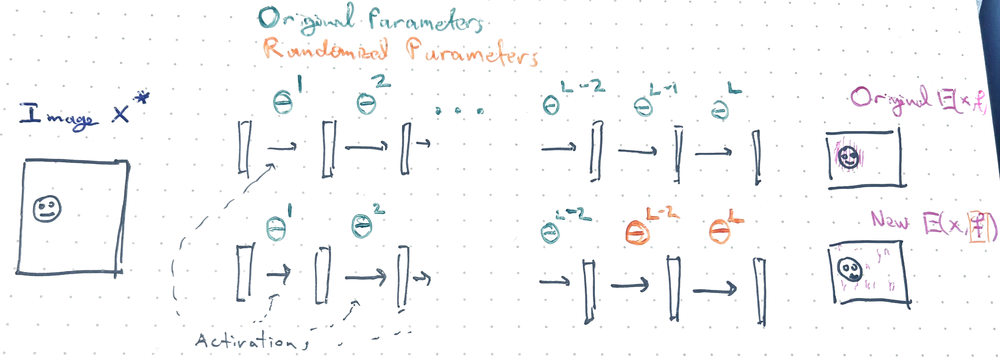
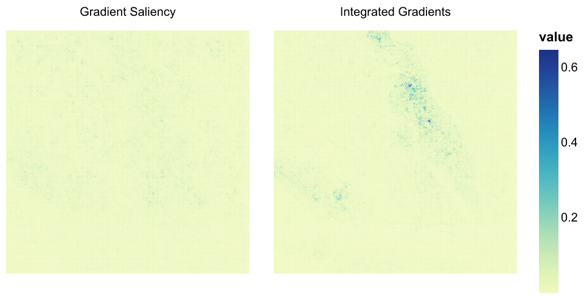
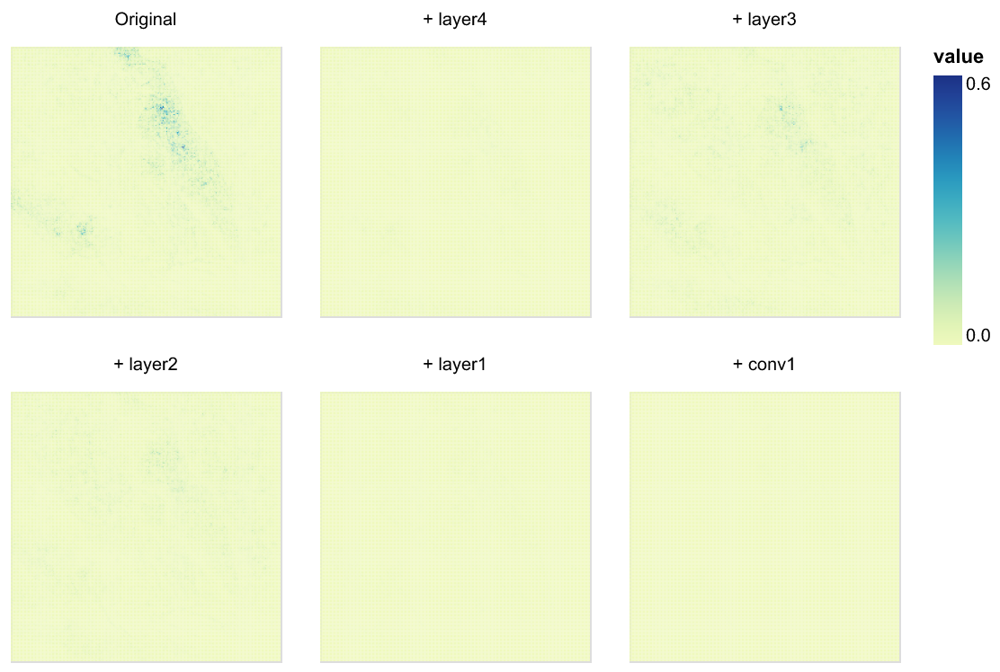

::: {style="display: none;"}
$$
\newcommand{\bs}[1]{\mathbf{#1}}
\newcommand{\reals}{\mathbb{R}}
\newcommand{\widebar}[1]{\overline{#1}}
\newcommand{\E}{\mathbb{E}}
\newcommand{\indic}[1]{\mathbb{1}\left\{{#1}\right\}}
\newcommand{\Earg}[1]{\mathbb{E}\left[{#1}\right]}
\newcommand{\Esubarg}[2]{\mathbb{E}_{#1}\left[{#2}\right]}
$$
:::

<style>
.purple { color: #7458d1ff; } /* pastel purple */
.orange { color: #fca020; } /* pastel orange */
.green { color: #3bbe67ff; } /* pastel green */
.darkblue { color: #4a9ceaff; } /* pastel dark blue */
.pink { color: #ee6ec3ff; } /* pastel pink */
</style>

```{r}
#| label: setup
#| echo: false
library(tidyverse)
library(reticulate)
theme_set(theme_classic() + theme(panel.border= element_rect(fill = NA, linewidth = .5)))
set.seed(2026)
```

```{r}
#| label: python-setup
#| echo: false
# includes the SHAP package. Can install it using,
# > conda env create -f stat479_week6.yml
# where the yaml file is located at: https://github.com/krisrs1128/stat479_notes/blob/master/notes/stat479_week11.yml
use_condaenv("stat479_week13")
```

_[Readings](https://papers.nips.cc/paper_files/paper/2018/file/294a8ed24b1ad22ec2e7efea049b8737-Paper.pdf)_, _[Code](https://github.com/krisrs1128/stat479_notes/blob/master/notes/13-saliency_handout.qmd)_

Items marked $^{\dagger}$ are not in the required reading and will not be
tested.

## Setup

1. **Goal.** A deep learning classifier $f_{\theta}$ maps a test image $x^\ast$ to class probabilities $\left(f_{\theta,1}(x^\ast), \dots, f_{\theta,K}(x^\ast)\right)$. We want per-pixel importance scores $E\left(x^\ast, f_{\theta}\right)$, called a saliency map, to explain the prediction.

1. **Requirement**. The saliency map should reflect properties of the trained model $f_\theta$ and not simply the structure in $x^\ast$.

1. **Approach.** Define saliency maps using $\nabla_x f_{\theta}(x)$ and apply
randomization tests ("sanity checks") to check the previous requirement.

## Motivation

1. _Model debugging_. Like SHAP, saliency maps can catch when a model makes the
correct prediction for the wrong reasons. For example, @DeGrave2021 applied deep
networks to classify chest radiographs as COVID-19 or healthy. The saliency map
below shows that the model learned a shortcut, a hospital-specific tag (top
right corner) that correlates with diagnosis because of class imbalance across
hospitals.

   {width=70%}

1. _Scientific Discovery_. In scientific applications our goal is often
mechanistic understanding, not just predictive accuracy. For example, @Labe2021
trained a model that predicts decade (e.g., 1970s or 2020s) from climate
simulation outputs. Their saliency map method showed that the model focused on
the north atlantic region when making these predictions.

   {width=90%}

1. _Need for Checks_. More generally, saliency maps can be used as a form of
model checking and explanation.  But as @adebayo2018 caution, this logic is not
sufficient without additional checks.  Some saliency methods highlight visually
salient regions regardless of what the model has actually learned.

1. _Beyond Images_. Though we focus on images, gradient-based explanations apply
to other types of data, e.g., see @Yang2023 for an application to genomic
features or the captum tutorials on
[text](https://captum.ai/tutorials/Llama2_LLM_Attribution) and [vision +
text](https://captum.ai/tutorials/Multimodal_VQA_Interpret) explanations.

## Saliency Map Methods

1. *Gradient Explanation*. If the sample $x^\ast$ is predicted
as class $k$, the simplest explanation is
$$E_{\text{grad}}\left(x^*, f_{\theta}\right) = \nabla_{x}f_{\theta,k}\left(x^\ast\right),$$
which measures how a small change to each input pixel changes the class $k$
probability. Pixels $d$ with the largest
$\left[|E_{\text{grad},f_{\theta}}|\right]_{d}$ matter the most for
the classification. Note that $\nabla_{x}f_{\theta,k}$ is a gradient with
respect to the input, _not_ the gradient $\nabla_{\theta}L\left(\theta\right)$
of the training loss with respect to the model parameters $\theta$, which is
used during gradient descent training.

   {width=90%}

    _Exercise: How would you modify this picture for a pixel that was in a nearly black region and which, when perturbed, makes no difference to the class $k$ prediction?_

1. *Input $\odot$ Gradient*. We can downweight the background by multiplying the
gradient by the input elementwise,
$$
E_{\text{grad-input}}\left(x^*, f_{\theta}\right) = x^*\odot\nabla_{x}f_{\theta,k}\left(x^\ast\right).
$$
This suppresses attributions in the darker regions where $x ^\ast \approx 0$.

    _Exercise: What are the dimensions $E_{\text{grad}}$ and $E_{\text{grad-input}}$? when applied to a $W\times H$ image? How is that visualized as a saliency map?_

    _Exercise: The Input $\odot$ Gradient method always assigns zero attribution to pixels where $x^\ast_j = 0$._

1. *Integrated Gradients*. The gradients of the softmax function vanish when the activations are large. Therefore, a confident model will have $\nabla_x f_{\theta, k}$ near zero even on important pixels. Integrated gradients address this by averaging over a path from a baseline $x_0$ (e.g., a black, all zeros image) to $x^\ast$,
$$
E_{\text{IG}}\left(x^*, f_{\theta}\right) = \int \nabla_{x}f_{\theta,k}\left(\alpha x^\ast +
\left(1 - \alpha\right)x_{0}\right) dx
$$
For intermediate values along this path, the activations are smaller and the
gradients will not have yet saturated. In practice, we approximate this integral
by a summation along a fine grid.

   {width=90%}

   

1. *SmoothGrad*. averages gradient explanations over noisy copies of the input,
$$E_{\text{SG}}(x^*, f_{\theta}) = \frac{1}{B}\sum_{b = 1}^{B} E_{\text{grad}}\left(x^* + \epsilon_{b}, f_{\theta}\right), \quad \epsilon_{b} \sim \mathcal{N}(0, \sigma^2).$$
This averaging results in smoother attribution maps.

    _Exercise: Compare and contrast one of these methods with SHAP._

    _Exercise: TRUE FALSE The Integrated Gradients and Gradient approaches give the same saliency map for a linear model $f\left(x\right) = w^\top x$._

## Sanity Checks

1. A key question is whether a saliency map depends on the trained model
$f_{\theta}$ or only on the test image $x^\ast$. @adebayo2018 study two
randomization tests to answer this. They can be viewed as negative controls --
setups that deliberately have no signal and which serve as a reference point for
interpretation.

1. **Model randomization** replaces trained weights with random weights layer by
layer from top to bottom. Any structure in the explanation that we still observe
reflects the model architecture, not what the model learned from the data. If
this is the only structure we see in the original saliency map, the method fails
the sanity check.
   ```
   Input:
     trained model f_θ with layers 1, ..., L (each with parameters θ^l)
     test input x*
     explanation method E(·, f_θ)   # e.g. gradient, integrated gradients,...
     similarity method Sim(E, E'), # e.g., Spearman correlation between pixel values

   # Baseline explanation on fully trained model
   E_original = E(x*, f_θ)
   explanations = [E_original]

   # Cascade from top layer down to bottom
   for l = L, L-1, ..., 1:
       θ^l ~ N(0, σ²) # randomize layer l
       E^(l) = E(x*, f_θ) # recompute explanation on partially-randomized model
       explanations.append(E^(l))

   # For each E^(l), return similarity to E_original
   similarities = [Sim(E^(l), E_original) for each E^(l) in explanations]

   {width=80%}

1. An explanation method passes if the similarity to the original degrades as
more layers are randomized. The results show that Gradient and GradCam pass, but
Guided BackProp and Guided GradCAM are nearly unchanged (their explanations are
nearly the same in the training and randomized settings).

   

   _Exercise: Why is cascading randomization done from the top layer down? Why not randomize from the bottom layer up?_

1. A subtlety is that for some methods, the absolute value of the saliency map
$\left|E\left(x^*, f_θ\right)\right|$ has high correlation with the original map
$E\left(x^*, f_θ\right)$ after randomization, but the signed maps do not.
Randomization breaks the sign of the attributions, but the magnitudes are a
property of the original test image. Overall, quantitative checks matter here
because saliency maps that look plausible to the eye can clearly fail under a
quantitative measure like rank correlation.

   

   _Exercise: Pick one of the panel from the figure above. Explain the associated experimental setup, how to read the output, and the implications for the saliency map methods that are considered._

1. **Data randomization** Instead of corrupting the model, this negative control
corrupts the data. Specifically, it permutes training labels $y_i$ and retrains
to high accuracy on the training data (this is possible with flexible
architectures, even if there is no signal). The model memorizes random
associations, so any explanation that is sensitive to the true $x$ vs. $y$
relationships learned by $f_\theta$ should return a very different, random
looking map after corruption.
   ```
   Input:
     training data {(x_i, y_i)}_{i=1}^{n}
     model architecture F
     test input x*
     explanation method E(·, f)
     similarity method Sim(E, E')

   # Train model on true labels
   f_true = train(A, {(x_i, y_i)})
   E_true = E(x*, f_true)

   # Permute labels and train on randomized data
   π = random_permute(1, ..., n)
   f_random = train(F, {(x_i, y_{π(i)})})   # train until 95% training accuracy on random labels
   E_random = E(x*, f_random)

   # Evaluate
   Sim(E_true, E_random)
   ```

   _Exercise: What are the relative compute costs for the two randomization tests? How do they scale with the samples?_

1. Again, Gradient and GradCAM pass the sanity check. Guided BackProp gives
plausible results even in the corrupted case, so it fails. For Integrated
Gradients, the signed maps change but the absolute value versions do not.

   {width=100%}

   {width=75%}

   _Exercise: For some models, we have access to the model's architecture definition but not the model weights. Which if any of the sanity checks discussed by @adebayo2018 can still be used?_

1. The takeaway from this paper is that new explanation methods require the same
methodological rigor that we apply when developing new models. Visual
plausibility alone is not strong enough evidence.

## Code Example

1. We'll use the `captum` package to create an integrated gradients saliency map
using a pretrained ResNet18 model. The block below defines some helper functions
for preprocessing and plotting.

   ```{python}
#| label: captum-setup
import torch
import numpy as np
import pandas as pd
import altair as alt
from PIL import Image
from torchvision import models, transforms
from captum.attr import Saliency, IntegratedGradients

def load_model():
    model = models.resnet18(weights=models.ResNet18_Weights.DEFAULT)
    model.eval()
    return model

def preprocess(img):
    transform = transforms.Compose([
        transforms.Resize(256),
        transforms.CenterCrop(224),
        transforms.ToTensor(),
        transforms.Normalize(mean=[0.485, 0.456, 0.406],
                             std=[0.229, 0.224, 0.225]),
    ])
    return transform(img).unsqueeze(0).requires_grad_(True)

def predict(model, input_tensor):
    with torch.no_grad():
        output = model(input_tensor)
    return output.argmax(dim=1).item()

def attribution_to_df(tensor, label):
    """Flatten the (1, C, H, W) attribution tensor to a DataFrame."""
    arr = tensor.squeeze().abs().mean(dim=0).detach().numpy()
    h, w = arr.shape
    ys, xs = np.mgrid[0:h, 0:w]
    return pd.DataFrame({"x": xs.ravel(), "y": ys.ravel(),
                         "value": arr.ravel(), "method": label})
   ```

1. I took this image from wikimedia's [image of the day](https://commons.wikimedia.org/wiki/Commons:Picture_of_the_day#/media/File:Little_corella_(Cacatua_sanguinea_gymnopis)_Blanchetown.jpg) (March 24).

   {width=30%}

1. The pretrained Residual Network model correctly identifies the image as showing a type of cockatoo [Class 89](https://salient-imagenet.cs.umd.edu/explore/class_89/feature_675.html).

   ```{python}
#| label: captum-run
model = load_model()
img = Image.open("figures/corella.jpg").convert("RGB")
input_tensor = preprocess(img)
target_class = predict(model, input_tensor)
print(target_class)
   ```

1. `Saliency` implements $E_{\text{grad}}\left(x^*, f_{\theta}\right)$, which
is initialized on the trained model and applied to samples $x^*$.

   ```{python}
#| label: gradients
saliency  = Saliency(model)
attr_grad = saliency.attribute(input_tensor, target=target_class)
   ```

1. The `IntegratedGradients` interface is nearly the same except for `n_steps`,
which controls how finely we should discretize the integration path.

   ```{python}
#| label: integrated-gradients
ig = IntegratedGradients(model)
attr_ig = ig.attribute(input_tensor, target=target_class, n_steps=50)
   ```

1. `IntegratedGradients` highlights the bird more clearly, so we must be in a
case where gradients are saturating.

   ```{python}
#| label: data-transformers
#| echo: false
#| output: false
alt.renderers.enable("png", scale_factor=2.0)
alt.data_transformers.enable("default")
alt.data_transformers.disable_max_rows()
   ```

   ```{python}
#| label: captum-plot
df = pd.concat([
    attribution_to_df(attr_grad, "Gradient Saliency"),
    attribution_to_df(attr_ig,   "Integrated Gradients"),
])

chart = alt.Chart(df).mark_rect().encode(
    x=alt.X("x:O", axis=None),
    y=alt.Y("y:O", axis=None),
    color=alt.Color("value:Q")
).properties(width=200, height=200).facet(
    facet=alt.Facet("method:N", title=None),
    columns=2,
).configure_view(strokeWidth=0);
   ```

   ```{python}
#| label: chart-output-1
#| echo: false
#| fig-align: center
import vl_convert as vlc
from pathlib import Path
Path("figures/_chart1.png").write_bytes(vlc.vegalite_to_png(chart.to_json(), scale=2))
   ```

   


1. We next run the model randomization test, randomizing layers from the top
down and computing the integrated gradients attribution at each step.

   ```{python}
#| label: cascade-randomization
#| output: false
import copy
from scipy.stats import spearmanr

def attr_flat(attr):
    return attr.squeeze().abs().mean(dim=0).detach().numpy().ravel()

cascade_layers = ["layer4", "layer3", "layer2", "layer1", "conv1"]
layer_order = ["Original"] + [f"+ {l}" for l in cascade_layers]

model_rand = copy.deepcopy(model)
attrs = {"Original": attr_ig}
for layer_name in cascade_layers:
    for param in model_rand.get_submodule(layer_name).parameters():
        torch.nn.init.normal_(param.data, std=0.1)
    attrs[layer_name] = IntegratedGradients(model_rand).attribute(input_tensor, target=target_class)
   ```

1. Even after the first layer, the Spearman correlations drop off.

   ```{python}
#| label: rank-correlations
orig_flat = attr_flat(attr_ig)
cascade_dfs = [attribution_to_df(attr, layer_order[i]) for i, attr in enumerate(attrs.values())]
[{"layer": l, "rank correlation": spearmanr(orig_flat, attr_flat(a)).statistic} for l, a in attrs.items()]
   ```

   We can see this effect in the visualizations. Even after randomizing the top
   layer, we no longer see the cockatoo appearing in the explanation.

   ```{python}
#| label: cascade-plot
df_cascade = pd.concat(cascade_dfs)

chart = alt.Chart(df_cascade).mark_rect().encode(
    x=alt.X("x:O", axis=None),
    y=alt.Y("y:O", axis=None),
    color=alt.Color("value:Q")
).properties(width=150, height=150).facet(
    facet=alt.Facet("method:N", title=None, sort=layer_order),
    columns=3,
);
   ```

   ```{python}
#| label: chart-output-2
#| echo: false
Path("figures/_chart2.png").write_bytes(vlc.vegalite_to_png(chart.to_json(), scale=2))
   ```

   
