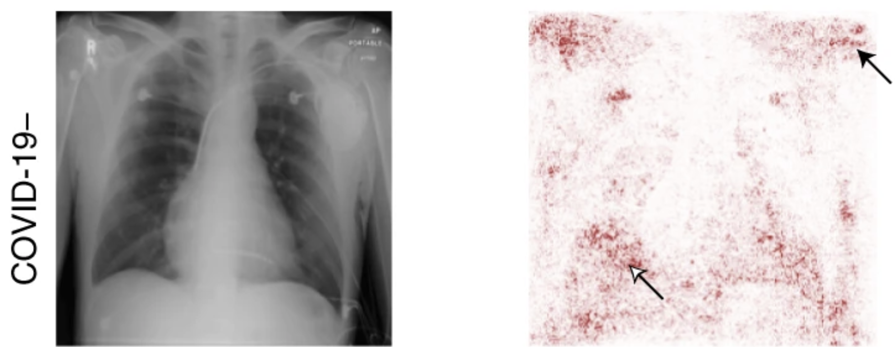
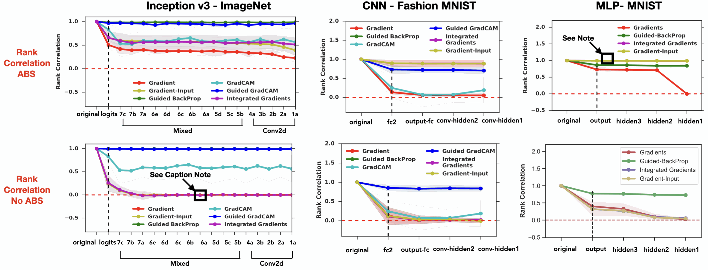
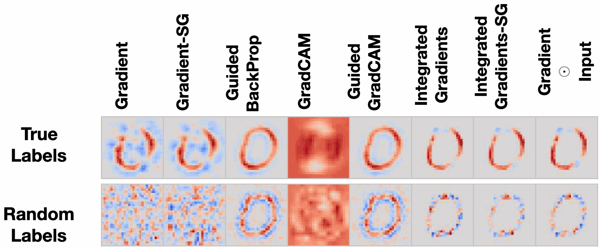
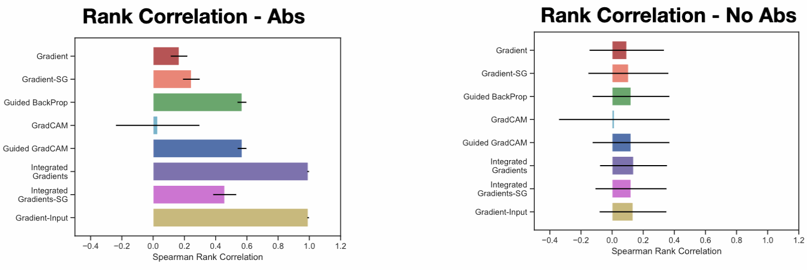

::: {style="display: none;"}
$$
\newcommand{\bs}[1]{\mathbf{#1}}
\newcommand{\reals}{\mathbb{R}}
\newcommand{\widebar}[1]{\overline{#1}}
\newcommand{\E}{\mathbb{E}}
\newcommand{\indic}[1]{\mathbb{1}\left\{{#1}\right\}}
\newcommand{\Earg}[1]{\mathbb{E}\left[{#1}\right]}
\newcommand{\Esubarg}[2]{\mathbb{E}_{#1}\left[{#2}\right]}
$$
:::

<style>
.purple { color: #7458d1ff; } /* pastel purple */
.orange { color: #fca020; } /* pastel orange */
.green { color: #3bbe67ff; } /* pastel green */
.darkblue { color: #4a9ceaff; } /* pastel dark blue */
.pink { color: #ee6ec3ff; } /* pastel pink */
</style>

```{r}
#| label: setup
#| echo: false
library(tidyverse)
library(reticulate)
theme_set(theme_classic() + theme(panel.border= element_rect(fill = NA, linewidth = .5)))
set.seed(2026)
```

```{r}
#| label: python-setup
#| echo: false
# includes the SHAP package. Can install it using,
# > conda env create -f stat479_week6.yml
# where the yaml file is located at: https://github.com/krisrs1128/stat479_notes/blob/master/notes/stat479_week11.yml
use_condaenv("stat479_week13")
```

_Readings: [1](https://papers.nips.cc/paper_files/paper/2018/file/294a8ed24b1ad22ec2e7efea049b8737-Paper.pdf)_, _[Code](https://github.com/krisrs1128/stat479_notes/blob/master/notes/13-saliency_handout.qmd)_

Items marked $^{\dagger}$ are not in the required reading and will not be
tested.

## Setup

**Goal** Suppose a deep learning image classifier $f$ maps a test image $x^\ast$ to a probability vector of $K$ classes $\left(f_{\theta}\left(x^\ast\right) = f_{\theta,1}\left(x^\ast\right), \dots, f_{\theta,K}\left(x^\ast\right)\right)$. We aim to develop a reliable local explanation $E\left(x^\ast, f_{\theta}\right)$ for a deep learning image classifier $f$ applied to a test image $x^\ast$.

1. **Requirements**

   - Each pixel $j$ in the test image $x^\ast$ must be associated with an
   explanation value $E_{j}\left(x^\ast, f_{\theta}\right)$ quantifying the importance of
   that pixel. We refer to this type of local image explanation as a _saliency
   map_.
    - Reliable means we should be able to check whether the saliency map is
    picking up on true properties of the model $f_{\theta}$ and not spurious
    features
    resulting from structure in $x^\ast$ alone.

1. **Approach**. We will define saliency maps using gradients $\nabla_{x}
f_{\theta}\left(x\right)$. We will then define negative controls ("sanity checks") that
allow us to test whether the properties we observe are meaningful.

## Motivation

1. Saliency maps were developed before SHAP, and they share similar motivations
-- identifying the most relevant features for specific predictions. As before, we want to ensure that our model makes the right predictions for the right reasons.

1. _Model debugging_. When introducing SHAP, we discussed how local feature
attribution can be useful for catching model "shortcuts" that would not
generalize well. This remains important for saliency maps. For example,
@DeGrave2021 applied deep networks to classify radiographic images into COVID-19
and healthy groups. An example saliency map is shown below. The model has
learned a shortcut through a small ID, which was hospital specific.  Since
classes are not balanced across hospitals, this could be used to improve
training accuracy, but is not the signal we want the model to pick up.



1. _Model validation_. Saliency maps that "focus" on the relevant parts of an
image is often used as a form of model validation. For example, @ref found that
a remote sensing model for tree species classification correctly highlighted the
parts of the image with the tree present. Though this is a common practice, we
will see below that without further sanity checks, a saliency map that
highlights an object of interest is in and of itself not useful.

1. _Beyond Images_. While we focus on images, the gradient-based methods
discussed below can be directly applied to other data types. For example
@Yang2023 used integrated gradients to prioritize regulatory features in a
genomic model. Further, the captum library we review below has tutorials for
applying gradient-based explanations to
[text](https://captum.ai/tutorials/Llama2_LLM_Attribution) and [vision +
text](https://captum.ai/tutorials/Multimodal_VQA_Interpret) data.

## Saliency Map Methods

1. *Gradient Explanation*. Suppose that test sample $x^\ast$ is predicted to
belong to class $k$. We use
$$E_{\text{grad}}\left(x^*, f\right) = \nabla_{x}f_{\theta,k}\left(x^\ast\right)$$
as our explanation. This gradient measures how a small change in each input
pixel changes the probability of the sample belonging to class $k$. Regions of
pixels with the largest magnitude gradient values are considered the most
important to the classification.

1. Notice that $\nabla_{x}f_{k,
\theta}$ is a gradient with respect to the input,
_not_ the gradient $\nabla_{\theta}L\left(\theta\right)$ of the training loss
with respect to the model parameters $\theta$, the usual quantity for gradient
descent training. The gradient $\nabla_{x}f_{\theta,k}$ used for explanation is
constructed independently of the loss and is focused on perturbations of the
input, not the model parameters.

1. *Input $\cdot$ Gradient*. A related approach considers the explanation,
$$
E_{\text{grad-input}}\left(x^*, f_{\theta}\right) = x^*\cdot\nabla_{x}f_{k,
theta}\left(x^\ast\right)
$$
the pointwise multiplication of the original image with the same gradient from
$E_{\text{grad}}$. This choice is motivated by the fact that it will downweight
darker regions of the image, where $x$ has values closer to 0.

1. *Integrated Gradients*. A difficulty with using the gradient
$\nabla_{x}f_{\theta,k}$ for classification models is that gradients "saturate."
Intuitively, if a model is very sure that $x^\ast$ belongs to class $k$, then
small perturbations in $x^\ast$ won't affect the predicted class by much.
Formally, this is because each coordinate of a softmax layer has gradient near
zero when the input activations are either very positive or very negative.

To address this, the integrated gradients method considers gradients along a
path of shrunken versions of $x^\ast$. Specifically, we compute,
$$
E_{\text{IG}}\left(x^*, f_{\theta}\right) = \int \nabla_{x}f_{\theta,k}\left(\alpha x^\ast +
\left(1 - \alpha\right)x_{0}\right) dx
$$
where $x_0$ is some baseline input (like the black, all zeros image). At these
shrunken versions of the input, the activations will be smaller, and so the risk
of saturated gradients decreases.


1. *SmoothGrad*. This method averages gradient explanations across many "noisy"
versions of the input.
$$
E_{\text{SG}}\left(x^*, f_{\theta}\right) = \frac{1}{B}\sum_{b = 1}^{B} E_{\text{grad}}\left(x^* + \epsilon_{b}, f_{\theta}\right)
$$
where $\epsilon_{b} \sim \mathcal{N}\left(0, \sigma^2\right)$ for some noise
level $\sigma^2$ and monte carlo sample size parameter $B$.  Qualitatively, this
tends to result in smoother attributions across neighboring pixels.

## Sanity Checks

1. @adebayo2018 was concerned that saliency maps might be picking up on
intrinsic features of the test images $x^\ast$ rather than any meaningful
characteristic of the models $f_{\theta}$. To this end, they designed negative
control experiments that can be used to quantify whether a saliency map method
learned meaningful patterns.

1. **Model randomization**. The first negative control is based on randomizing the
model parameters. Intuitively, any meaningful structure in the explanation
should be destroyed after replacing the trained model weights with random
values.  If structure is still present, then that reflects a property of the
overall model class (e.g., transformer layers in general) rather than the
particular dataset it was trained on, and the explanation method fails the
sanity check.

1. This is formalized in the algorithm below. We say an explanation method
passes the test if the similarities decreases across $l = L, L - 1, \dots, 1$.

```
Input:
  trained model f_θ with layers 1, ..., L (each with parameters θ^l)
  test input x*
  explanation method E(·, f_θ)   # e.g. gradient, integrated gradients,...
  similarity method Sim(E, E'), # e.g., Spearman correlation between pixel values

# Baseline explanation on fully trained model
E_original = E(x*, f_θ)
explanations = [E_original]

# Cascade from top layer down to bottom
for l = L, L-1, ..., 1:
    θ^l ~ N(0, σ²) # randomize layer l
    E^(l) = E(x*, f_θ) # recompute explanation on partially-randomized model
    explanations.append(E^(l))

# For each E^(l), return similarity to E_original
similarities = [Sim(E^(l), E_original) for each E^(l) in explanations]
```

1. This analysis allows us to generate figures like the one below. Surprisingly,
many of the "explanations" fail the model randomization test. In fact, the
simpler methods seem to do better than many of the more sophisticated ones.


1. These qualitative results are quantified through the `Sim()` function. The
fact that some correlations never decay (especially in the ABS case, which
considers $\left|E\left(x^*, f_θ\right)\right|$) suggests that at least some of
the structure in the attributions is irrelevant. @adebayo2018 argues that these
quantiative checks are necessary, because explainability outputs that seem
qualitatively plausible collapse under quantitative scrutiny.



1. **Data randomization** defines a different negative control by breaking the
relationship between $x_i$ and $y_i$. Rather than modifying an already trained
model, it trains a new model using a corrupted dataset. This addresses the
concern that the model randomization weights might not be realistic -- the
weights in this method are the genuine result of a full model training
procedure.

1. Specifically, the check follows the pseudocode below. An saliency map method
passes the check if the similarity is low.

```
Input:
  training data {(x_i, y_i)}_{i=1}^{n}
  model architecture F
  test input x*
  explanation method E(·, f)
  similarity method Sim(E, E')

# Train model on true labels
f_true = train(A, {(x_i, y_i)})
E_true = E(x*, f_true)

# Permute labels and train on randomized data
π = random_permute(1, ..., n)
f_random = train(F, {(x_i, y_{π(i)})})   # train until 95% training accuracy on random labels
E_random = E(x*, f_random)

# Evaluate
Sim(E_true, E_random)
```

1. This method can be used to generate figures like the one below. The takeaway
from this figure is again that some well-known saliency map methods are simply
capturing properties of the test inputs $x^\ast$ rather than meaningful
characteristics of the trained model $f_{\theta}$.



We can quantify this using the `Sim()` function as before. In this case, it
reveals that the ABS version of the explainabililty technique fails the sanity
check, but the signed version passes. Indeed, in the visualization output, the
explanations for the randomly labeled data still have zeros, but they are a mix
of positive and negative attributions, unlike the original explanations, which
are mostly positive.



## Discussion

1. For most of this class, we've focused on novel methods, but not so much on
benchmarking. Indeed, compared to supervised learning tasks, it is much more
challenging to quantitatively compare interpretability methods. Nonetheless,
this paper does exactly that, and the fact that it highlights widespread
misinterpretation shouldn't be seen as discouraging, if anything it is an
important advance.

1. Ultimately, the goal of research in interpretability is to create methods
that support accurate interpretation in real problems. To achieve this goal
requires more than new tools -- it requires deeper understanding of the basic
properties of these methods and the settings in which they excel/break down.
Checks like the model and data randomization tests are progress towards this
goal.

## Code Example

1. We'll use the `captum` package to create an integrated gradients saliency map
using pretrained weights from imagenet. The block below defines some helper
functions unrelated to the core attribution step, but which are necessary for
running the pretrained model and plotting the saliency maps.

```{python}
#| label: captum-setup
import torch
import numpy as np
import pandas as pd
import altair as alt
from PIL import Image
from torchvision import models, transforms
from captum.attr import Saliency, IntegratedGradients

def load_model():
    model = models.resnet18(weights=models.ResNet18_Weights.DEFAULT)
    model.eval()
    return model

def preprocess(img):
    transform = transforms.Compose([
        transforms.Resize(256),
        transforms.CenterCrop(224),
        transforms.ToTensor(),
        transforms.Normalize(mean=[0.485, 0.456, 0.406],
                             std=[0.229, 0.224, 0.225]),
    ])
    return transform(img).unsqueeze(0).requires_grad_(True)

def predict(model, input_tensor):
    with torch.no_grad():
        output = model(input_tensor)
    return output.argmax(dim=1).item()

def attribution_to_df(tensor, label):
    """Flatten the (1, C, H, W) attribution tensor to a DataFrame."""
    arr = tensor.squeeze().abs().mean(dim=0).detach().numpy()
    h, w = arr.shape
    ys, xs = np.mgrid[0:h, 0:w]
    return pd.DataFrame({"x": xs.ravel(), "y": ys.ravel(),
                         "value": arr.ravel(), "method": label})
```

1.  I took this image from wikimedia's [image of the day](https://commons.wikimedia.org/wiki/Commons:Picture_of_the_day#/media/File:Little_corella_(Cacatua_sanguinea_gymnopis)_Blanchetown.jpg) (March 24). The pretrained Residual Network model correctly identifies the image as showing a type of cockatoo [Class 89](https://salient-imagenet.cs.umd.edu/explore/class_89/feature_675.html)_.

```{python}
#| label: captum-run
model = load_model()
img = Image.open("figures/corella.jpg").convert("RGB")
input_tensor = preprocess(img)
target_class = predict(model, input_tensor)
print(target_class)
```

1. Captum provides a consistent interface to several saliency map methods.
$E_{\text{grad}}\left(x^*, f_{\theta}\right)$ is implemented by the `Saliency` class,
which needs to be intialized on the trained model and which can then be applied
to any sample $x^*$.

```{python}
#| label: gradients
saliency  = Saliency(model)
attr_grad = saliency.attribute(input_tensor, target=target_class)
```

1. Nearly the same interface works with $E_{\text{IG}}\left(x^*, f_{\theta}\right)$,
except that we have to specify how finely we should discretize the integration
path.

```{python}
#| label: integrated-gradients
ig = IntegratedGradients(model)
attr_ig = ig.attribute(input_tensor, target=target_class, n_steps=50)
```

1. Finally, we visualize the results. `IntegratedGradients` are better able to
highlight the bird, so we must be in a case where gradients are saturating.

```{python}
#| label: captum-plot
alt.data_transformers.enable("default")
alt.data_transformers.disable_max_rows()

df = pd.concat([
    attribution_to_df(attr_grad, "Gradient Saliency"),
    attribution_to_df(attr_ig,   "Integrated Gradients"),
])

alt.Chart(df).mark_rect().encode(
    x=alt.X("x:O", axis=None),
    y=alt.Y("y:O", axis=None),
    color=alt.Color("value:Q")
).properties(width=200, height=200).facet(
    facet=alt.Facet("method:N", title=None),
    columns=2,
).configure_view(strokeWidth=0)
```


1. We next run the model randomization sanity check. We create a copy of the
model, `model_rand`, that we progressively destroy. The `attrs` object saves all
the intermediate attributions for this sample and will let us create
visualizations and rank correlation sumamrizes.

```{python}
#| label: cascade-randomization
import copy
from scipy.stats import spearmanr

def attr_flat(attr):
    return attr.squeeze().abs().mean(dim=0).detach().numpy().ravel()

cascade_layers = ["layer4", "layer3", "layer2", "layer1", "conv1"]
layer_order = ["Original"] + [f"+ {l}" for l in cascade_layers]

model_rand = copy.deepcopy(model)
attrs = {"Original": attr_ig}
for layer_name in cascade_layers:
    for param in model_rand.get_submodule(layer_name).parameters():
        torch.nn.init.normal_(param.data, std=0.1)
    attrs[layer_name] = Saliency(model_rand).attribute(input_tensor, target=target_class)
```

1. Even after the first layer, the spearman correlations drop off.

```{python}
#| label: rank-correlations
orig_flat = attr_flat(attr_ig)
cascade_dfs = [attribution_to_df(attr, layer_order[i]) for i, attr in enumerate(attrs.values())]
[{"layer": l, "rank correlation": spearmanr(orig_flat, attr_flat(a)).statistic} for l, a in attrs.items()]
```

We can see this effect in the visualizations as well. Even after randomizing the
top layer, we no longer see the cockatoo appearing in the explanation.

```{python}
#| label: cascade-plot
df_cascade = pd.concat(cascade_dfs)

alt.Chart(df_cascade).mark_rect().encode(
    x=alt.X("x:O", axis=None),
    y=alt.Y("y:O", axis=None),
    color=alt.Color("value:Q")
).properties(width=150, height=150).facet(
    facet=alt.Facet("method:N", title=None, sort=layer_order),
    columns=3,
)
```
