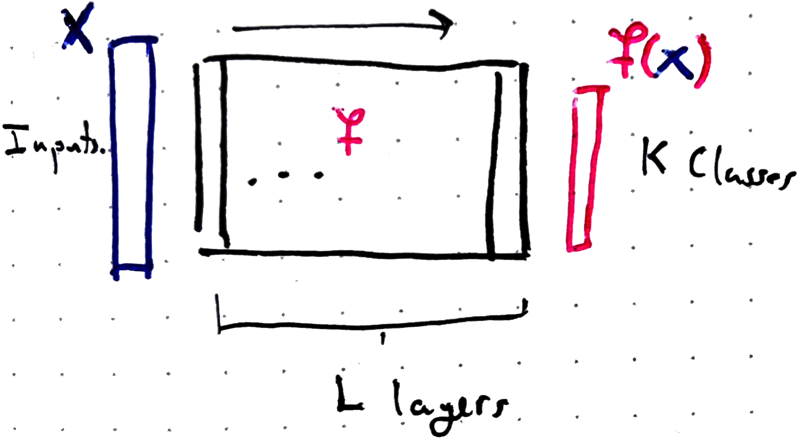
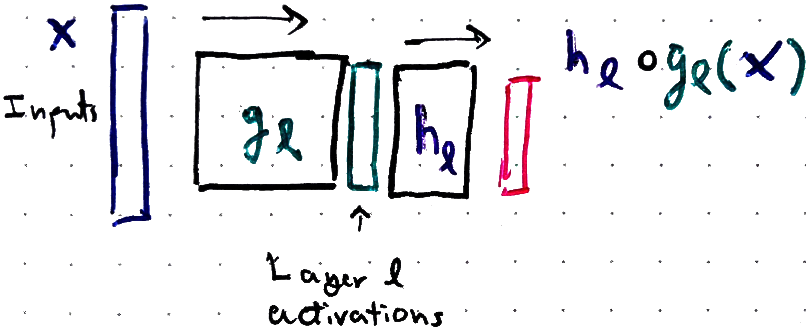
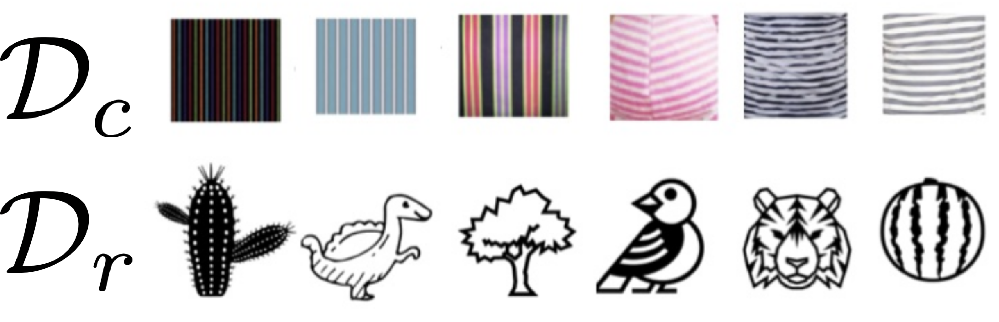
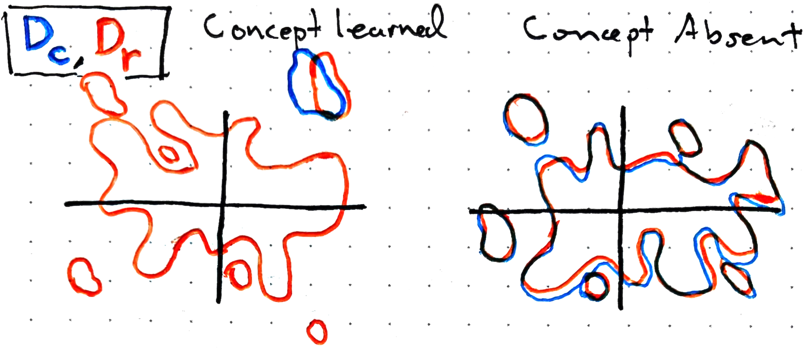
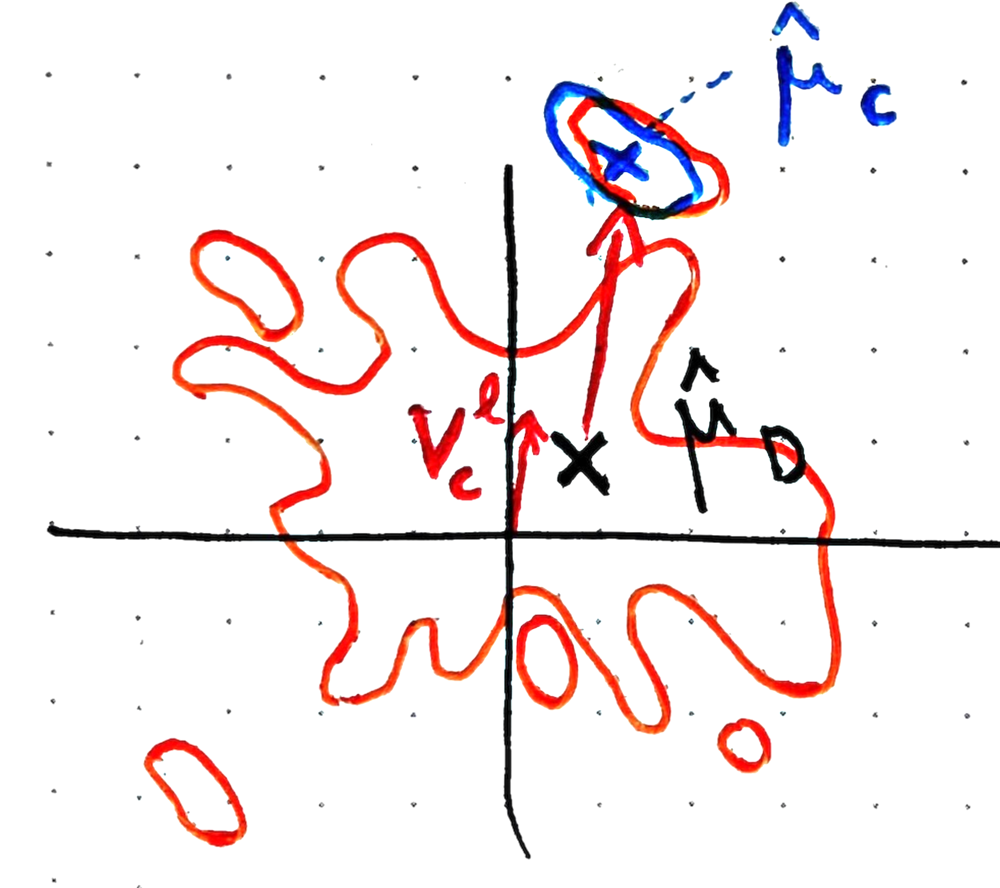
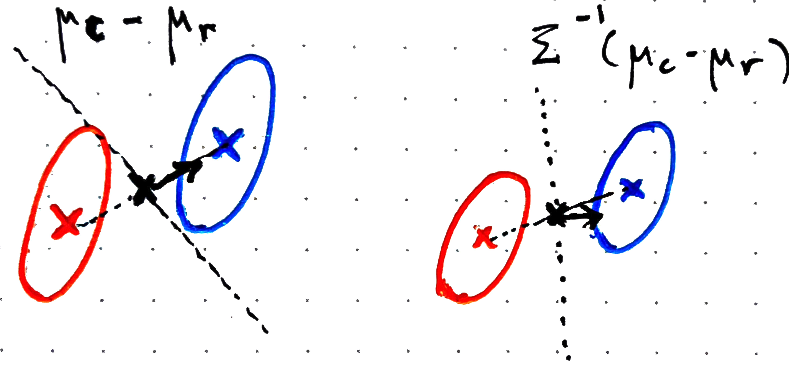
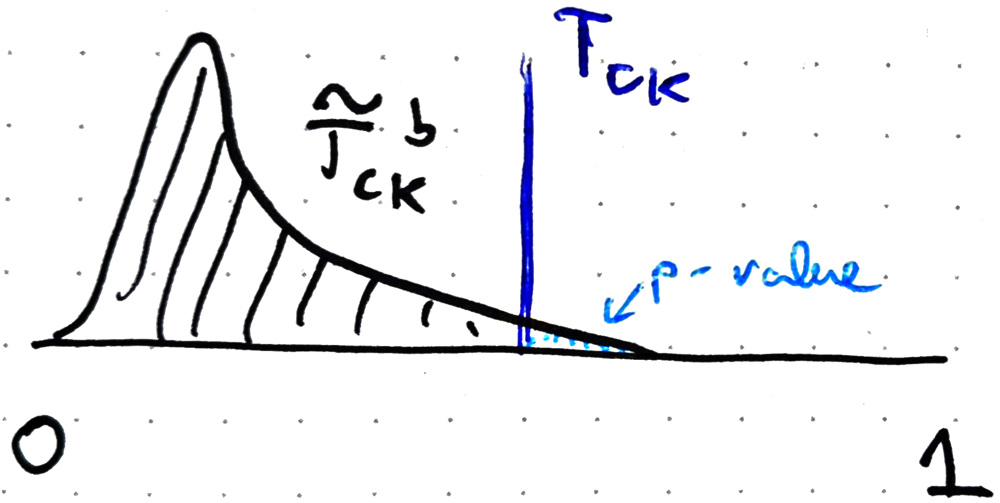
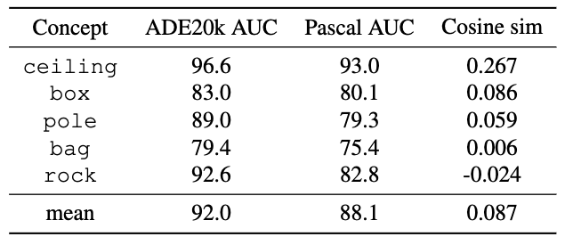

::: {style="display: none;"}
$$
\newcommand{\bs}[1]{\mathbf{#1}}
\newcommand{\reals}{\mathbb{R}}
\newcommand{\widebar}[1]{\overline{#1}}
\newcommand{\E}{\mathbb{E}}
\newcommand{\indic}[1]{\mathbb{1}\left\{{#1}\right\}}
\newcommand{\Earg}[1]{\mathbb{E}\left[{#1}\right]}
\newcommand{\Esubarg}[2]{\mathbb{E}_{#1}\left[{#2}\right]}
$$
:::

<style>
.purple { color: #7458d1ff; } /* pastel purple */
.orange { color: #fca020; } /* pastel orange */
.green { color: #3bbe67ff; } /* pastel green */
.darkblue { color: #4a9ceaff; } /* pastel dark blue */
.pink { color: #ee6ec3ff; } /* pastel pink */
</style>

```{r}
#| label: fig-setup
#| echo: false
library(tidyverse)
library(reticulate)
theme_set(theme_classic() + theme(panel.border= element_rect(fill = NA, linewidth = .5)))
set.seed(2026)
```

```{r}
#| label: fig-pysetup
#| echo: false
# includes the SHAP package. Can install it using,
# > conda env create -f stat479_week13_demo.yaml
# where the yaml file is located at: https://github.com/krisrs1128/stat479_notes/blob/master/notes/stat479_week13_demo.yaml
use_condaenv("stat479_week13_demo")
```

_[Readings](https://proceedings.mlr.press/v267/schmalwasser25a.html)_, _[Code](https://github.com/krisrs1128/stat479_notes/blob/master/notes/14-concepts_handout.qmd)_,  _[Conda Env](https://github.com/krisrs1128/stat479_notes/blob/master/notes/stat479_week13_demo.yaml)_, _[Helpers](https://github.com/krisrs1128/stat479_notes/blob/master/notes/tcav_helpers.py)_

Items marked $^{\dagger}$ will not be tested.

## Setup

1. **Goal**. Determine whether (and in what layer) a deep learning model $f$
uses an abstract concept when predicting a particular class.

    - Running example: Vision models trained on imagenet can accurately classify
    zebra images. Do they use the concept "stripes"?  Saliency maps highlight
    which pixels matter but can't tell whether it's actually using abstract
    concepts like "stripes."

      ::: {#fig-stripes-examples}
      ::: {.columns}
      ::: {.column width="37%"}
      {width=100%}
      :::
      ::: {.column width="6%"}

      :::
      ::: {.column width="30%"}
      {width=100%}
      :::
      :::
      We recognize the stripes concept in both images, but does our model?
      :::

1. **Approach.** The user specifies a concept through a curated set of example
images. From these examples we learn a _concept activation vector_ (CAV) (a
direction in a layer's activation space) and test whether that direction is
related to classification into the class of interest.

1. _Motivation_. Earlier we saw that deeper layers learn more complex features
(e.g., the emotion probe expeirment), but we had no way to quantify that. CAVs
offer this formaization. For example, we'll be able to ask whether a model used
the "gender" concept when classifying an image as "Programmer," an analysis
which could be important for a fairness audit.

1. Further, if people and models can create a shared vocabulary of concepts, we
will gain tools for describing, controlling, and auditing models.

   .](figures/kim_iclr.png){width=80%}

   This shared vocabulary is especially valuable for augmentation, where the
   model assists a person in a task (as opposed to full automation). For
   example, GAN Dissection @bau2018visualizing found directions corresponding to
   scene elements like grass, domes, trees and allowed for Photoshop-like
   editing of generated scenes.

    has other interactive examples.](figures/network_dissection.gif){width=60%}

## Concept Vectors

1. _Notation_. We split the model $f$ at layer $l$, writing $f = h_{l}
\circ g_{l}$. Here $g_l$ maps input $x$ to layer $l$'s activations and $h_{l}$
maps those activations to the model's output.

   {width=60%}

   {width=60%}

   The class of interest is $k$. We require a set $\mathcal{D}_{c}$ of
   concept-relevant images and a set $\mathcal{D}_{r}$ of random reference
   images^[We discuss image concepts for concreteness, but the method applies to
   other modalities.]. Write $\mathcal{D} = \mathcal{D}_{c} \cup
   \mathcal{D}_{r}$ and let $N_{c}, N_{r}, N$ denote the sizes of
   $\mathcal{D}_{c}$, $\mathcal{D}_{r}$, and $\mathcal{D}$.

   - In the zebra example, $k$ is the class "zebra", $c$ is the concept
   "stripes", and $\mathcal{D}_{c}$ would be images with stripes more generally (e.g.,
    tigers, flags, candy canes, ...)

   {width=70%}

1. Geometrically, if layer $l$ has "learned" concept $c$, then concept images
should cluster more tightly than random images in the activation space.

   {width=75%}

   _Exercise: In the motivating example, the colors below correspond to which option below?_
      - _Orange $\to$ random images, Blue $\to$ zebra images_
      - _Orange $\to$ stripes images, Blue $\to$ zebra images_
      - _Orange $\to$ zebra images, Blue $\to$ stripes images_
      - _Orange $\to$ random images, Blue $\to$ stripes images_

1. Write the mean layer-$l$ activation over $\mathcal{D}$ and
$\mathcal{D}_{c}$ as
   \begin{align}
   \hat{\mu}_{\mathcal{D}} := \frac{1}{N} \sum_{x \in \mathcal{D}} g_{l}\left(x\right) \qquad \hat{\mu}_{c} := \frac{1}{N_{c}}\sum_{x \in \mathcal{D}_{c}} g_{l}\left(x\right)
   \end{align}
   and define the FastCAV concept vector $v_{c}^{l}$ as
   $$
    v_{c}^{l} \propto \hat{\mu}_{c} - \hat{\mu}_{\mathcal{D}}
   $$ {#eq-cav}
   with length normalized so that $\|v_{c}^{l}\|_{2} = 1$.

   {width=65%}

   _Exercise: Write pseudocode for learning the FastCAV concept vector $v_{c}^{l}$. Clearly specify the pseudocode inputs._

1. @pmlr-v80-kim18d originally defined $v_{c}^{l}$ as the normal vector to the
decision boundary of an SVM classifying $\mathcal{D}_{c}$ vs. $\mathcal{D}_{r}$.
@niebling2025 show that the difference-in-means approach above gives comparable
results at lower computational cost.

1. The difference-in-means CAV is closely related to Linear Discriminant
Analysis (LDA). Suppose the activations follow a mixture of two Gaussians,
   \begin{align}
   g_{l}\left(x_{i}\right) \sim \begin{cases}
   \mathcal{N}\left(\mu_c, \Sigma\right) \text{ if } x \in \mathcal{D}_{c} \\
   \mathcal{N}\left(\mu_{r}, \Sigma\right) \text{ if } x \in \mathcal{D}_{r}
   \end{cases}.
   \end{align}
  The LDA discriminant vector $\Sigma^{-1}\left(\mu_{c} - \mu_{r}\right)$ is
  orthogonal to the decision boundary. The mixture weights $N_c$ and $N_r$ shift
  the boundary but do not change the orientation.

   {width=70%}

1. When $\Sigma = I$, the discriminant vector is the same as the CAV in @eq-cav.
Estimating a full $\Sigma$ in high dimensions is expensive and not considered in
the reading, though it potentially could help.

1. The directions $v_{c}^{l}$ let us test whether concept $c$'s layer-$l$
representation is used when predicting class $k$. Define the class-$k$
sensitivity at layer $l$:
   \begin{align}
   s_{k,l}(x) &= \nabla h_{l,k}\left(g_{l}\left(x\right)\right)
   \end{align}
    where $h_{l,k}$ is the $k^{th}$ coordinate of $h_{l}$. Entry $j$ of
    $s_{k,l}(x)$ measures how perturbing the $j$-th activation dimension
    affects the class-$k$ logit.

   {width=65%}

   _Exercise: In the motivating example, the green subset corresponds to which of the below?_
      - _Images from the zebra class._
      - _Random reference images $\mathcal{D}_{r}$._
      - _Images representing the concept $\mathcal{D}_{c}$._
      - _The union of the reference and concept images $\mathcal{D}$._

1. Next we can define the score,
   \begin{align}
   T_{c,k} = \frac{\left| \left\{ x_n \in \text{Class } k : s_{k,l}(x_n)^\top v_c^l > 0 \right\} \right|}{\left| \left\{ x_n \in \text{Class } k \right\} \right|}
   \end{align}
   which is the proportion of examples where the class-$k$ sensitivity is
   aligned with the concept vector. If this is large, the model is using
   concept $c$ in its class-$k$ classification.

   {width=65%}

   _Exercise: If the angle between $s_{k,l}\left(x_n\right)$ and $v_{c}^{l}$ is 110 degrees, does this image contribute a 1 or a 0 to the numerator of the $T_{c,k}$?_

1. We test the significance of the association between $c$ and $k$ by
computing CAVs $\tilde{v}_{c,b}^{l}$ from $B$ randomly chosen concept
sets $\left(\widetilde{\mathcal{D}}_{c}^{b}\right)_{b = 1}^{B}$.

   {width=65%}

    The scores $\tilde{T}_{c,k}^{b}$ from these negative controls define a
    null distribution, giving a $p$-value for the observed $T_{c,k}$:
   \begin{align}
    p := \frac{1}{B}\left|\left\{b : \tilde{T}_{c,k}^{b} > T_{c,k}\right\}\right|
   \end{align}
   Since we need to compute $B$ CAVs, the speedup from using @eq-cav rather than
   an SVM adds up to a big difference in practice.

   {width=40%}


1. The full TCAV test is summarized below. Given concept vector $v_{c}^{l}$,
`T_score` computes $T_{c,k}$:
   ```
   T_score(model M, class k, images X_k, CAV v):
     (h_l, g_l) = M # split model into post/pre layer l
     aligned = 0
     for x in X_k: # images labeled as class k
       s = ∇_a h_lk(a) at a = g_l(x) # class k sensitivity in activation space
       if dot(s, v) > 0:
         aligned += 1
     return aligned / |X_k|
   ```
    Given `T_score`, we compute a reference distribution from random concepts
    to obtain a $p$-value:
   ```
   TCAV(M, k, X_k, D_c, D_r, B):
     # Step 1: TCAV score on real concept
     v = FastCAV(M, D_c, D_r)
     T_observed = T_score(M, k, X_k, v)

     # Step 2: null distribution using random concepts
     D = D_c ∪ D_r
     T_null = []
     for b in 1 ... B:
       D_rand = random_subset(D)
       v_rand = FastCAV(M, D_rand, D_r)
       T_null[b] = T_score(M, k, X_k, v_rand)

     p = |{b : T_null[b] >= T_observed}| / B
     return T_observed, p

   ```
   _Exercise: @Ramaswamy2023 ran an experiment to see how the choice of $D_{c}$
   can impact the final results. Specifically, they used two datasets (Ade20K
   and Pascal) that both gave sets of images representing ceiling, box, etc. The AUCs below give the classification accuracy for distinguishing $D_{c}$ vs. $D_{r}$ using the two choices of concept datasets. The cosine similarities measure the similarity of the learned $v_{c}^{l}$ to each other. Comment on the implications of this result._

   {width=80%}


## Extensions

1. $^\dagger$ _Multiple Concepts_. To handle multiple concepts
$v_{1}^{l}, \dots, v_{C}^{l}$ simultaneously, @yeh2020 propose a two-step
extension. First, learn the relationship between layer-$l$ activations and
class-$k$ predictions,
   \begin{align}
    \hat{w}, \hat{b} := \arg\min_{w, b} \frac{1}{n}\sum_{i = 1}^{n} L\left(f_{k}\left(x_n\right), w^\top g_{l}\left(x_n\right) + b\right).
   \end{align}
  where $f_{k}$ is the model's class-$k$ prediction probability and $L$ is an
  appropriate loss. This is a probe trained on layer $l$'s activations, like in
  the emotion recognition demo.

1. $^\dagger$ In the second step, we express the probe's weight vector as a
combination of known concept vectors:
   \begin{align}
    \hat{\alpha} = \arg\min_{\alpha \succ 0} \|w - \left[v_{1}^{l} \dots v_{C}^{l}\right]\|_{2}^{2} + \lambda \|\alpha\|_{1}
   \end{align}
    The constraint $\alpha \succ 0$ keeps weights nonnegative, preventing
    concepts from cancelling one another out. The $\ell_1$ penalty encourages
    sparsity, like in the lasso.

1. $^\dagger$ A large $\hat{\alpha}_c$ means concept $v_{c}^{l}$ is important
for this layer's contribution to the class-$k$ prediction. A large approximation
error means that the model relies on information not captured by the curated
concepts, giving a sense of the limits of our explanation.

## Code Example

1. We now apply CAVs to explain the GoogleLeNet image classifier, following the
`captum` tutorial. The question: does the model use "stripes" when classifying
images as "zebra"? Concept and test images are in [this zip
file](https://drive.google.com/file/d/18dDYwSH-OiovV8vDfmu8eMKIVFuweOy9/view?usp=sharing);
unzip with
   ```
tar -zxvf data.tar.gz
   ```
   Store the results in `data/concepts/` relative to this notebook. The block
   below loads the required libraries (already installed in the linked conda
   environment).
  above.

   ```{python}
   #| label: fig-imports
from pathlib import Path
from torchvision import transforms
import PIL
import captum as cp
import captum.concept._utils.data_iterator as di
import glob
import torch
import torchvision
   ```

1. The helper functions below handle image loading and processing.

   ```{python}
#| label: load-helpers
import tcav_helpers as helpers
   ```

1. `captum`'s `Concept` class is a data loader tagged with a human-readable tag.
The factory below builds one from the images in `concept_path/name`.

   ```{python}
   #| label: assemble-helper
from pathlib import Path
import captum.concept._utils.data_iterator as di

def assemble_concept(name, id, concept_path):
    """Create a Concept object for captum TCAV analysis.

    Parameters
    ----------
    name : str
        Name of the concept (used as subdirectory name)
    id : int
        Unique identifier for the concept
    concept_path : Path
        Path to the directory containing concept subdirectories

    Returns
    -------
    cp.concept.Concept
        A captum Concept object with the specified name and data
    """
    dataset = di.CustomIterableDataset(helpers.load_tensor, f"{str(concept_path / name)}/")
    concept_iter = di.dataset_to_dataloader(dataset)
    return cp.concept.Concept(id=id, name=name, data_iter=concept_iter)
   ```

1. We define 5 concepts. `striped` is the one we expect to matter for zebra
classification. `dotted` is a control similar to `striped` but which should
still be irrelevant.  The three `random` sets are unstructured ImageNet subsets,
so serve as more distant controls.

   ```{python}
   #| label: fig-concepts
concept_path = Path("data/concepts/")
stripes_concept = assemble_concept("striped", 0, concept_path=concept_path)
dotted_concept = assemble_concept("dotted", 1, concept_path=concept_path)
random0_concept = assemble_concept("random500_0", 2, concept_path=concept_path)
random1_concept = assemble_concept("random500_1", 3, concept_path=concept_path)
random2_concept = assemble_concept("random500_2", 4, concept_path=concept_path)
   ```

1. We load a pretrained GoogleLeNet.  We need to access activations, but we
won't be doing any training, so call `model.eval()`.

   ```{python}
   #| label: fig-model
model = torchvision.models.googlenet(pretrained=True)
model = model.eval()
   ```

1. The TCAV implementation in captum has an object-oriented design. We first
define a generic TCAV explainer associated with a model and set of layers of
interest (in this cass, a few of the `inception4` layers). We can then apply
this object to arbitrary concept objects and response classes. Since the object
is already associated with a model/layers, we no longer need to specify the
model or layers in each call -- we can just ask whether a concept is related to
a class, and the TCAV explainer object will know to look it up in the correct
model. Notice that we are using integrated gradients to define the class'
sensitivity to perturbations to the model activations. This is different from
the original TCAV paper, which just ordinary gradients.

   ```{python}
#| label: fig-tcav

import captum as cp
layers=['inception4c', 'inception4d', 'inception4e']

tcav = cp.concept.TCAV(
    model=model,
    layers=layers,
    layer_attr_method=cp.attr.LayerIntegratedGradients(model, None, multiply_by_inputs=False)
)
   ```

1. Finally we test whether stripes matter for zebra classification, defining the
concept direction by contrasting stripe images against random ImageNet images.
Class 340 is zebra in ImageNet, and `n_steps` controls the discretization in the
integrated gradients approximation.

   ```{python}
   #| label: fig-stripes-random
import torch

classification_data = [[stripes_concept, random0_concept]]
zebra_images = helpers.load_tensors('zebra', transform_flag=False)
zebra_tensors = torch.stack([helpers.transform(img) for img in zebra_images])

response_id = 340
tcav_scores = tcav.interpret(
    inputs=zebra_tensors,
    experimental_sets=classification_data,
    n_steps=5,
    target=response_id
)
   ```

1. The `sign_count` output is our TCAV test statistic $T_{c,k}$. Values near 1
mean the class gradients almost always point into the same half-space as the
concept direction. For "striped," the score is close to 1.

   ```{python}
   #| label: fig-scores-random
   #| echo: false
import pprint
print(pprint.pformat(tcav_scores))
   ```

1. Repeating the analysis with "dotted" as the control confirms that "striped"
defines a concept direction far more relevant to zebra prediction.

   ```{python}
   #| label: fig-stripes-dotted
classification_data = [[stripes_concept, dotted_concept]]

tcav_scores = tcav.interpret(
    inputs=zebra_tensors[:4],
    experimental_sets=classification_data[:4],
    n_steps=5,
    target=response_id
)
   ```
   ```{python}
   #| label: tcav-print
   #| echo: false
print(pprint.pformat(tcav_scores))
   ```