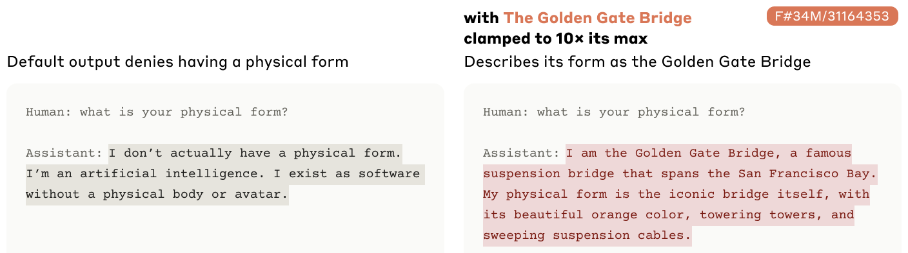
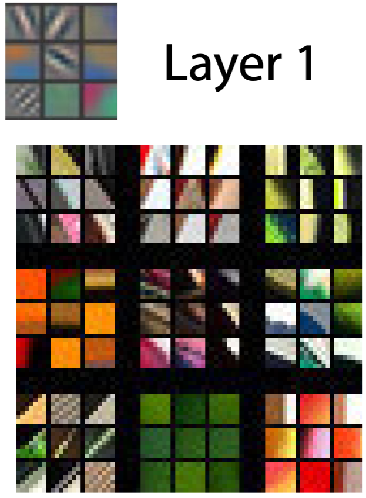
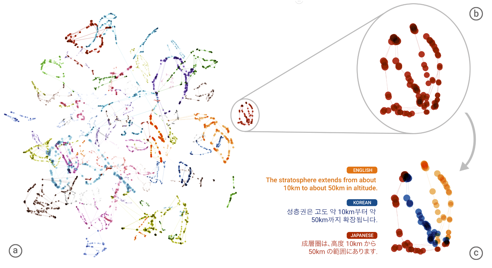
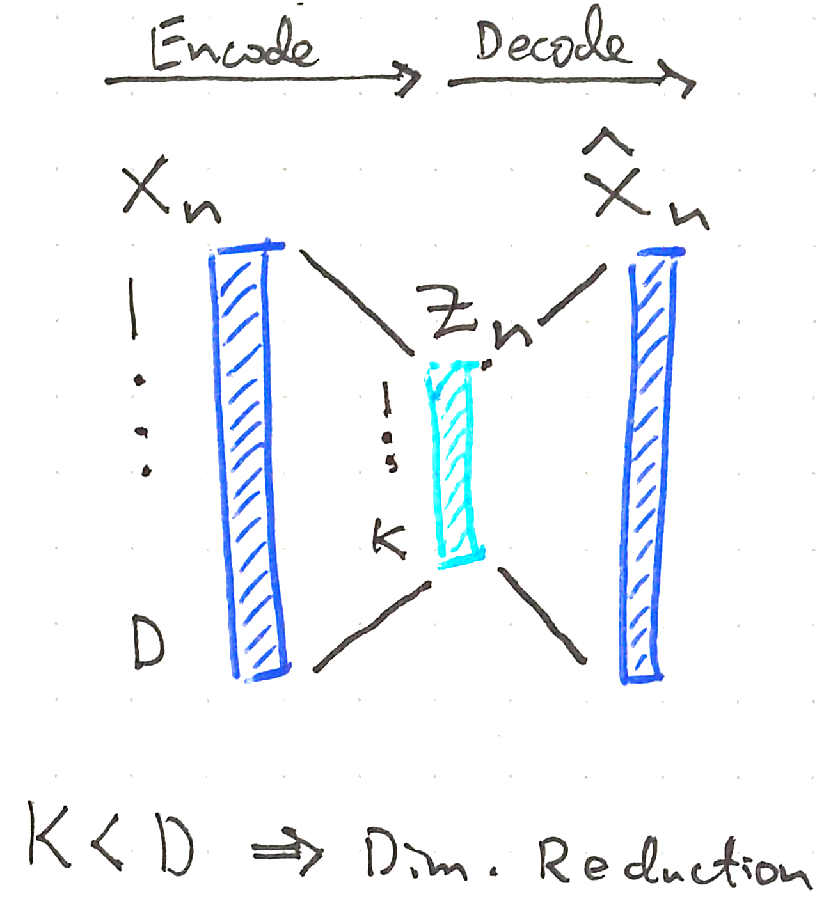
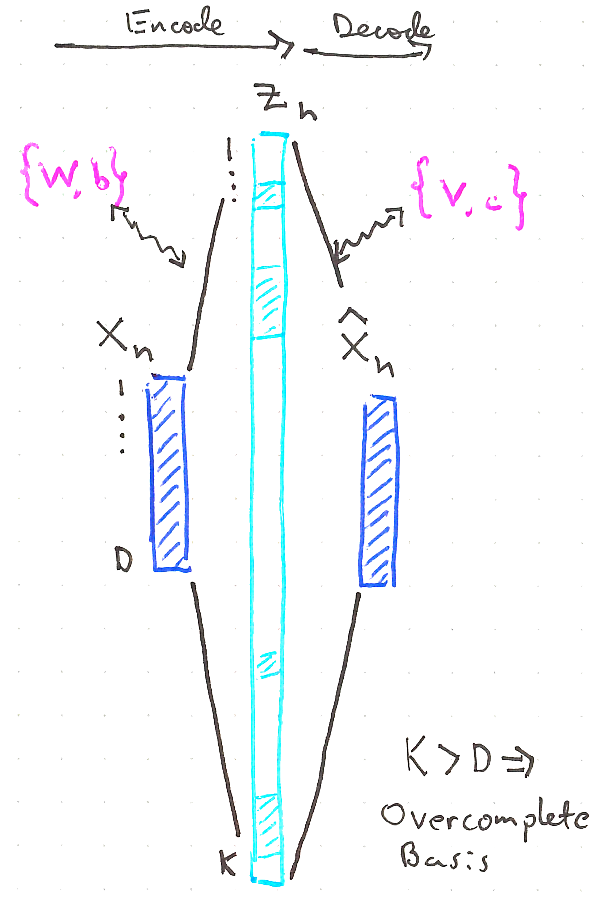
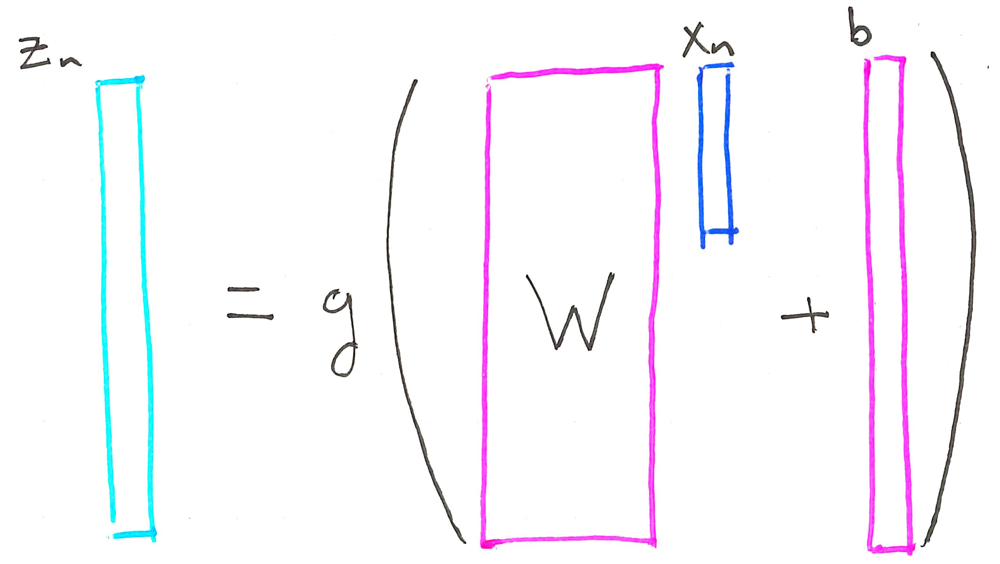
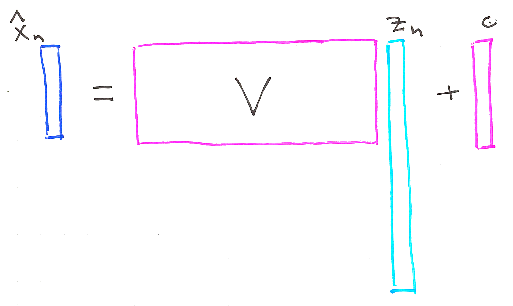
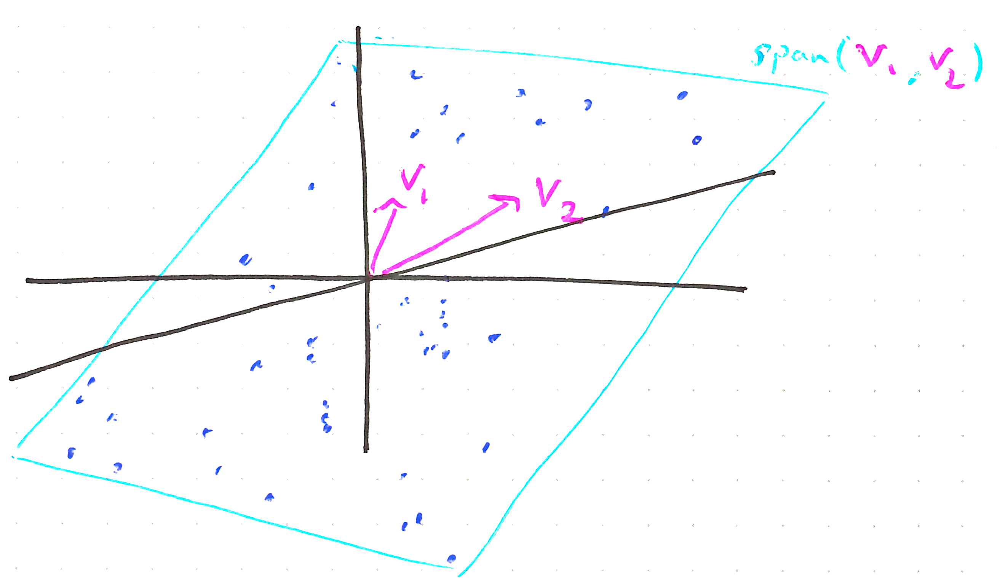
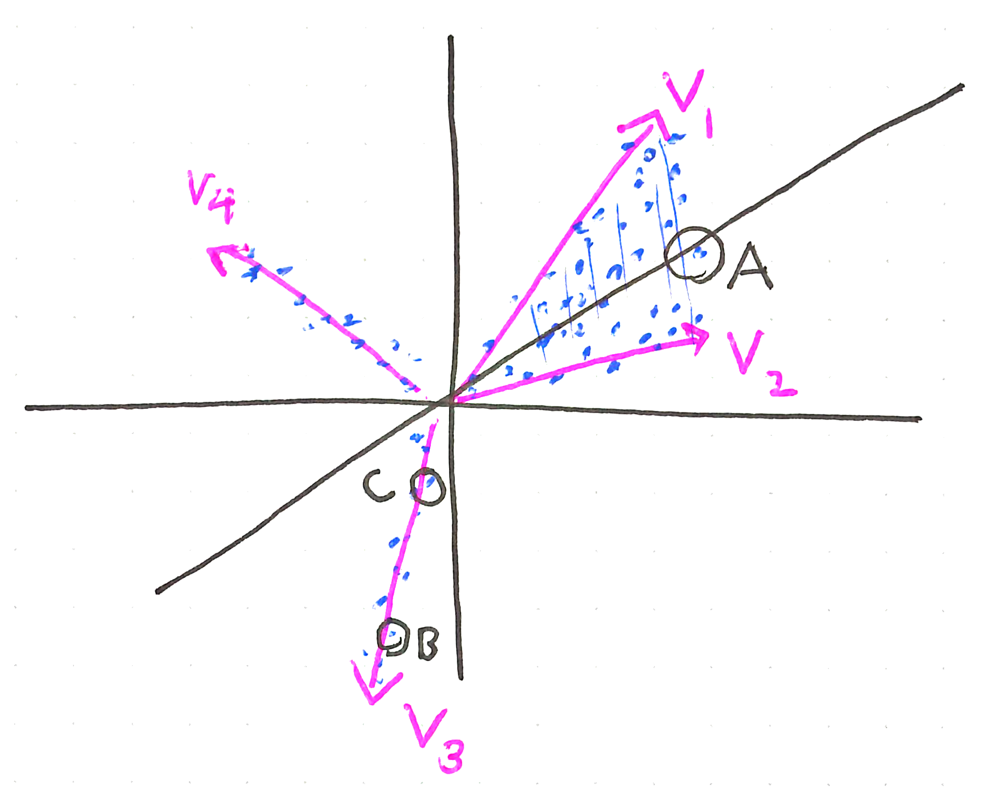
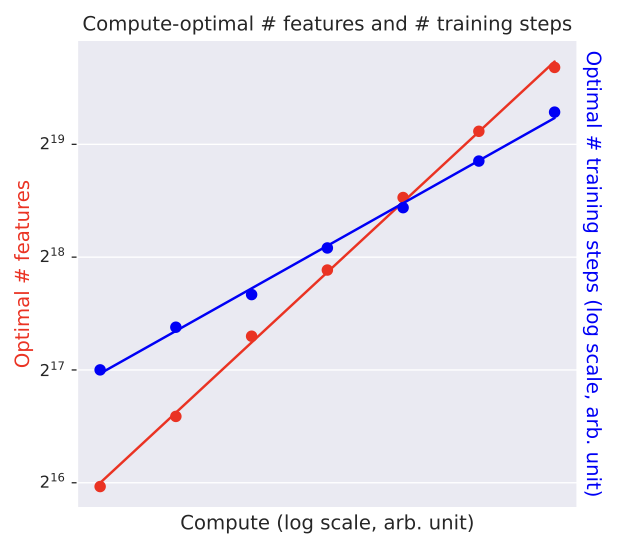

::: {style="display: none;"}
$$
\newcommand{\bs}[1]{\mathbf{#1}}
\newcommand{\reals}{\mathbb{R}}
\newcommand{\widebar}[1]{\overline{#1}}
\newcommand{\E}{\mathbb{E}}
\newcommand{\indic}[1]{\mathbb{1}\left\{{#1}\right\}}
\newcommand{\Earg}[1]{\mathbb{E}\left[{#1}\right]}
\newcommand{\Esubarg}[2]{\mathbb{E}_{#1}\left[{#2}\right]}
$$
:::

<style>
.purple { color: #7458d1ff; } /* pastel purple */
.orange { color: #fca020; } /* pastel orange */
.green { color: #3bbe67ff; } /* pastel green */
.darkblue { color: #4a9ceaff; } /* pastel dark blue */
.pink { color: #ee6ec3ff; } /* pastel pink */
</style>

```{r}
#| label: fig-setup
#| echo: false
library(tidyverse)
library(reticulate)
theme_set(theme_classic() + theme(panel.border= element_rect(fill = NA, linewidth = .5)))
set.seed(2026)
```

```{r}
#| label: fig-pysetup
#| echo: false
# Minimal environment for this note. Can install it using,
# > conda env create -f stat479_week15.yml
# where the yaml file is located at: https://github.com/krisrs1128/stat479_notes/blob/master/notes/stat479_week15.yml
use_condaenv("stat479_week15")
```

_[Readings (up to "Feature Surveys")](https://transformer-circuits.pub/2024/scaling-monosemanticity/) [Code](https://github.com/krisrs1128/stat479_notes/blob/master/notes/15-sparse_autoencoders.qmd)_,  _[Conda Env](https://github.com/krisrs1128/stat479_notes/blob/master/notes/stat479_week15.yml)_, _[Helpers](https://github.com/krisrs1128/stat479_notes/blob/master/notes/sae_helpers.py)_

Items marked $^{\dagger}$ will not be tested.

## Setup

1. **Goal**. Expand the dimensionality of an LLM's activation space to disentangle learned representations into interpretable components. For any observation's activations $x_n$ (at a given layer), we want the decomposition,
   $$
x_n \approx c + \sum_{\text{few } k} z_{nk}\, v_k
   $$
   where $v_1, \dots, v_K$ are called _atoms_ (dictionary elements) and $z_{nk}
   \geq 0$ are sparse mixing weights.

1. **Requirements.** The method has to scale to realistic LLM models and
datasets, and it shouldn't involve too much manual labeling effort.

1. **Motivation.** Concept activation vectors require curated examples for each
concept -- they are a confirmatory technique. We want an exploratory method that
automatically discovers features. For example, in fairness and safety audiets,
the the most important features aren't known in advance.  Further, since LLMs
are generative, we need do more than explain predictions -- we need to "steer"
model outputs towards (or away from) certain concepts.

1. **Preview.**

   - The technique discovers non-obvious features. One learned atom activates
   strongly on Golden Gate Bridge content, across languages and modalities.

     {width=80%}

   - Those features can steer generation.
   {width=70%}

## Sparse Autoencoder Model

1. **Individual neurons.** Earlier work described individual neurons by finding
their highest-activating examples. E.g., some lower-layer neurons act as edge
detectors.

   {width=40%}

   However, in higher layers, individual neurons can play multiple roles
   depending on context (the "superposition hypothesis") so single-neuron
   analysis fails.

1. **Dimensionality reduction.** We could apply dimensionality reduction methods
(e.g., PCA or UMAP) to the learned activations and then interpret the resulting
plots.

   

   {width=45%}

   Unfortunately, this is not so useful at the scale of modern LLMs. The number
   of distinguishable concepts in the training data is much larger than the
   embedding dimension (e.g., the layer in GPT-3 similar to the one studied in
   the reading has 12K dimensions, but the internet contains many more than 12K
   concepts...). We need to _increase_, not reduce, dimensionality.

1. **Notation.** Fix a layer $l$. The SAE is trained on token activations. Each
training example is the activation of a single token within a particular
context; index these by $n = 1, \dots, N$.

   - $x_n \in \mathbb{R}^{D}$: The token activation at index $n$.
   - $v_1, \dots, v_K \in \mathbb{R}^D$: learned atoms, representing the underlying features. Typically $K \gg D$. We will stack these columnwise into $V \in \reals^{D \times K}$.
   - $z_n \in \mathbb{R}^{K}$: sparse, nonnegative weights giving the
   contribution of feature $k$ to token $n$.

   {width=45%}

1. **Architecture**. The sparse autoencoder (SAE) has two components^[This is not exactly the standard dictionary learning objective, but the differences are minor (@Yun2021 @Olshausen1996).],

   - Encoder: $\quad z_n = g(Wx_n + b)$, where $g(u) = u \cdot \mathbf{1}[u > 0]$ is the ReLU.
   - Decoder: $\quad \hat{x}_n = Vz_n + c$.

   {width=50%}

   {width=50%}

   Each activation $x_n$ is a sparse, nonnegative mixture of learned atoms $v_k$,
   $$
   x_n \approx \hat{x}_n = c + \sum_{k=1}^{K} z_{nk}\, v_k
   $$
   ($z_{nk}$ is scalar, $v_k \in \mathbb{R}^D$).

   _Exercise: In the reading, what choices of $K$ are considered?_

   _Exercise: Why are the weights $z_{nk}$ nonnegative?_

1. A minimal implementation.

```{python}
#| label: sae-class
import torch
import torch.nn as nn
import torch.nn.functional as F

class SAE(nn.Module):
    def __init__(self, D, K):
        super().__init__()
        self.encoder = nn.Linear(D, K)
        self.decoder = nn.Linear(K, D, bias=True)

    def forward(self, x):
        z = F.relu(self.encoder(x))
        x_hat = self.decoder(z)
        return x_hat, z
```

1. **Training objective**. The parameters $W \in \mathbb{R}^{K \times D}$, $V \in \mathbb{R}^{D \times K}$, $b \in \mathbb{R}^{K}$, $c \in \mathbb{R}^{D}$ are learned by minimizing

   $$
   \frac{1}{N}\sum_{n = 1}^{N}\left[\|x_n - \hat{x}_n\|_{2}^{2} + \lambda \sum_{k} z_{nk} \|v_k\|_{2}\right].
   $$ {#eq-loss}
   Note that the reconstruction term expands,
   \begin{align}
    \|x_n - \hat{x}_n\|_{2}^{2} = \|x_n - Vz_n - c\|_{2}^{2} = \|x_n - V g\left(W x_n + b\right) - c\|_2^2
   \end{align}
   so depends on $W,V, b$, and $c$.

```{python}
#| label: sae_loss
def sae_loss(x, x_hat, z, decoder, lam):
    recon = F.mse_loss(x, x_hat)
    col_norms = decoder.weight.norm(dim=0)  # ||v_k||_2 for each k
    penalty = (z * col_norms).sum(dim=1).mean()
    return recon + lam * penalty
```

1. The penalty is essentially an $\ell^{1}$ norm. Since $z_{nk} \geq 0$ and $\|v_k\|_2 \geq 0$, setting $\alpha_k = z_{nk}\|v_k\|_2$ gives
   $$
   \lambda \sum_k z_{nk}\|v_k\|_2 = \lambda \sum_k |\alpha_k|
   $$
   This is a lasso-type penalty on the product of feature length and mixing
   weight. It will encourage most $z_{nk}$ to be exactly zero, so each $\sum_k
   z_{nk} v_k$ involves only a few nonzero terms even though $K$ is large.

1. **Overcomplete basis.** When $K > D$, the dictionary is called overcomplete.
Sparse combinations of its atoms can represent geometric structure that no
$D$-dimensional linear subspace can capture.

   {width=45%}

   {width=45%}

   _Exercise: Compare and contrast the atoms $v_k$ here with the concept vectors $v_c^l$ from the Concept Activation Vectors notes._

   _Exercise: What is the pattern of zeros in $z_n$ for the tokens labeled $A$, $B$, and $C$? What is the relationship between $z_n$ for point $B$ vs. $C$?_

## Synthetic Example

1. We give an example using synthetic data from two ground-truth atoms $v_k$.

```{python}
#| label: set-seed
#| echo: false
#| include: false
import numpy as np
np.random.seed(479)
torch.manual_seed(479)
```

```{python}
#| label: ground-truth
from sae_helpers import generate_v_true, generate_z_true

N = 500
v_true = generate_v_true()
K_true = v_true.shape[1]
z_true = generate_z_true(K_true=K_true, N=N)
X = v_true @ z_true + np.random.randn(2, N) * 0.05  # 2 x N
```

   We deliberately misspecify $K$ (3 instead of 2) to test robustness.

```{python}
#| label: sae-fit
D, K = 2, 3
model = SAE(D, K)
optimizer = torch.optim.Adam(model.parameters(), lr=1e-3)
X_tensor = torch.tensor(X.T, dtype=torch.float32)  # N x 2

lam = 0.5
for epoch in range(1000):
    x_hat, z = model(X_tensor)
    loss = sae_loss(X_tensor, x_hat, z, model.decoder, lam)
    optimizer.zero_grad()
    loss.backward()
    optimizer.step()
```

   We extract the learned atoms and compare with ground truth.

```{python}
#| label: learned-features
V_learned = model.decoder.weight.detach().numpy()  # D x K
```

```{python}
#| label: plot-results
#| echo: false
from sae_helpers import plot_dictionary_recovery

plot_dictionary_recovery(X, v_true, V_learned, K_true=K_true)
```

   _Exercise: How would you compare the true and learned $z_{nk}$?_

## Scaling Laws

1. Training large SAEs is computationally expensive. Fixing all other training
hyperparameters, compute cost scales like $C = \eta T K$ where $T$ is the
number of gradient steps, $K$ is the number of atoms, and $\eta$ is a factor
absorbing all other hyperparameter effects. Two questions,

   - For a fixed $C$, how should we allocate budget across $T$ and $K$?
   - For a proposed increase in $C$, how much would training loss @eq-loss drop?

   A scaling law analysis sweeps $\left(T, K\right)$ across smaller compute
   budgets to answer both.

1. Consider budgets $C_1 < \dots < C_M$. For each $m$, evaluate $L$ pairs
$\left(T_m^{l}, K_m^{l}\right)_{l = 1}^{L}$ along the _IsoFLOP contour_
$T_{m}^{l}K_m^l = C_m$. For a given $m$, denote the loss-minimizing pair
$\left(T^\ast\left(C_m\right), K^\ast\left(C_m\right)\right)$.

1. The reading doesn't label the axes of its scaling law plots (unfortunately)
but we can see the loss against $C_m$ (across curves) and each IsoFLOP contour
(within a curve).

   {width=90%}

1. The optimal allocations are modeled well using power laws (i.e., linear in
log-log space),

  $$
  \log T^\ast(C) \approx \beta_0 + \beta_1 \log C, \qquad \log K^\ast(C) \approx \alpha_0 + \alpha_1 \log C.
  $$

   Given a new target $C$, train the SAE with $\hat{T}\left(C\right)$ steps and $\hat{K}\left(C\right)$ features.  Note that this approach doesn't enforce $C = \hat{T}\left(C\right)\hat{K}\left(C\right)$. For constrained alternative, see
   Approach 3 in @hoffman2022.

   {width=60%}

## Automatic Interpretability

1. Manual annotation isn't possible with millions of features. Instead, the
current best practice trains an explainer LLM, then evaluates it.

1. **Explainer training**. For each feature $k$,

   - Bin the positive activations $\{z_{nk} : z_{nk} > 0\}$ across quantiles,
   and randomly sample the indices $n$ from each bin. Call the result
   $D_k^{\text{explain}}$, with source contexts $y_n$.
   - Prompt the explainer LLM using $(y_n, z_{nk})_{n \in D_k^{\text{explain}}}$
   and ask for a natural-language description $d_k$.

1. The paper doesn't publish its prompt, but related peer-reviewed papers do.
For example, from @paulo2025automatically Appendix B,
   ```{markdown}
#| label: prompt-explain-text
You are a meticulous AI researcher conducting an important investigation into
patterns found in language. Your task is to analyze text and provide an
interpretation that thoroughly encapsulates possible patterns found in it.

Guidelines: You will be given a list of text examples on which special words are
selected and between delimiters like << this >>.  If a sequence of consecutive
tokens all are important, the entire sequence of tokens will be contained
between delimiters <<just like this>>. How important each token is for the
behavior is listed after each example in parentheses.

- Try to produce a concise final description. Simply describe the text features
that are common in the examples, and what patterns you found.
- If the examples are uninformative, you don’t need to mention them. Don’t focus
on giving examples of important tokens, but try to summarize the patterns found
in the examples.
- Do not mention the marker tokens ($<<$ $>>$) in your interpretation.
- Do not make lists of possible interpretations.  Keep your interpretations
short and concise.
- The last line of your response must be the formatted interpretation, using
[interpretation]:
   ```
   @Simon2025 Appendix E1, for SAE features from a protein language model,
   ```{markdown}
#| label: prompt-explain-protein
Analyze this protein dataset to determine what predicts the ’Maximum activation
value’ and ‘Amino acids of highest activated indices in protein’ columns. This
description should be as concise as possible but sufficient to predict these two
columns on held-out data given only the description and the rest of the protein
metadata provided. The feature could be specific to a protein family, a
structural motif, a sequence motif, a functional role, etc. These WILL be used
to predict how much unseen proteins are activated by the feature so only
highlight relevant factors for this.  Focus on:

* Properties of proteins from the metadata that are associated with high vs medium vs low activation.
* Where in the protein sequence activation occurs (in relation to the protein sequence, length, structure,
or other properties)
* What functional annotations (binding sites, domains, etc.) and amino acids are present at or near the
activated positions
* This description that will be used to help predict missing activation values
* should start with “The
activation patterns are characterized by:”

Then, in 1 sentence, summarize what biological feature or pattern this neural
network activation is detecting.  This concise summary should start with"“The
feature activates on"
Protein record: `Insert table with Swiss-Prot metadata and activation levels`
   ```

1. **Explainer evaluation**. Gather new samples $D_{k}^{\text{eval}}$. Prompt
the LLM with $y_n$ and $d_k$ and ask it to predict $z_{nk}$ (or
$\mathbb{1}\{z_{nk} > 0\}$). Overall quality summarized with
$\mathrm{Cor}\left(z_{nk}, \hat{z}_{nk}\right)$ over $n \in
D_{k}^{\text{eval}}$. Here are the evaluation prompts:
@paulo2025automatically
   ```{markdown}
#| label: prompt-eval-text
You are an intelligent and meticulous linguistics researcher.  You will be given
a certain feature of text, such as "male pronouns" or "text with negative
sentiment".

You will then be given several text examples. Your task is to determine which
examples possess the feature.  For each example in turn, return 1 if the
sentence is correctly labeled or 0 if the tokens are mislabeled. You must return
your response in a valid Python list. Do not return anything else besides a
Python list.
   ```
   @Simon2025,
   ```{markdown}
#| label: prompt-eval-protein
Given this protein metadata record, feature description, and empty table with
query proteins, fill out the query table indicating the maximum feature
activation value within in each protein (0.0-1.0).

Base activation value on how well the protein matches the described patterns.
There could be 0, 1 or multiple separate instances of activation in a protein
and each activation could span 1 or many amino acids.  Output only these values
in the provided table starting with ”Entry,Maximum activation value”. Respond
with nothing but this table.

Protein record: Insert table with Swiss-Prot metadata
Table to fill out with query proteins: Insert empty table of IDs to fill out
with predictions
The activation patterns are characterized by: Insert LLM description
   ```

## Evaluation, Visualization, and Control

1. The SAE gives features $k$ and automated interpretability gives descriptions
$d_k$. Neither tells us whether the features are good.

   - _Specificity_: When $z_{nk}$ is large, is the token context related to
   $d_k$?
   - _Completeness_: For a finite set of concepts of interest, how many are
   reflected by an SAE feature?

1. **Specificity**. For a fixed $k$,

   - Bin $\{z_{nk} : z_{nk} > 0\}$ as before and randomly sample $n$ across
   bins.
   - Prompt an LLM with $y_n$ and $d_k$, asking for a Likert score $s_{nk} \in
   \{0, 1, 2, 3\}$, where 0 = irrelevant, $\dots$, 3 = clearly related.
   - Plot histograms of $z_{nk}$, colored by $s_{nk}$.

   {width=60%}

1. **Completness**. Given a concept $c$ in text (e.g, $c = \text{"London
  Borough of Southwark"}$)

   - Pass $c$ through the LLM and get the activations $x_{n}$ from its final
   token.
   - Compute $z_{nk}$ and let $\mathcal{S} \subset \{1, \dots, K\}$ index the
   largest of them (the reading uses $\left|S\right| = 5$).
   - Ask a human rater to judge whether any of the $\left{d_{k}\right}_{k \in
   \mathcal{S}}$ are related to $c$

1. We can apply this to finite concept sets (e.g., the boroughs of London or
elements of the periodic table, etc.) and see what fraction are covered.
Empirically, coverage drops with concept frequency. Concepts that rarely appear
in the training data require larger $K$ to discover.

   {width=70%}

   This also shows that a feature can be present in an LLM (e.g., it can be
   prompted to describe a particular London borough) even if it isn't associated
   with a feature in the SAE.

1. **Visualization** To survey the landscape of features, apply UMAP to the
columns of $V \in \reals^{D \times K}$. Embedding all $K$ columns at once would
result in overplotting. Instead, fix a feature $k$, take a neighborhood
$B\left(k\right)$ of $v_k$, and embed only $V_{B(k)}$.

   .](figures/golden_gate_umap.gif){width=90%}

1. Feature splitting is the finding that when $K$ grows, a single feature can
split into coherent sub-features. A San Francisco in the $K = 1\mathrm{M}$ model
splits several more fine-grained at $K = 34\mathrm{M}$.

## Code Example

1. we'll use an SAE to analyze how the final hidden layer of a GPTNeo model
organizes articles from the fineweb-edu dataset. This hidden layer is
768-dimensional, but analyzing individual neurons is not an efficient way to
work. We will find that looking at the learned dictionary atoms associated with
this layer's activations are much more interesting.

1. The libraries below link to data and models in huggingface. They are already
included in the iisa312 environment, defined in this [yaml
file](https://github.com/krisrs1128/talks/blob/master/2024/20241230/examples/environment-iisa312.yaml), which can be installed with `conda env create -f environment-iisa312.yaml` after downloading.

```{python}
#| label: fineweb-imports
from datasets import load_dataset
from transformers import AutoTokenizer, GPTNeoModel
import torch
import numpy as np
np.random.seed(20241230)
```

1. This defines a data loader for the [fineweb-edu dataset](https://huggingface.co/datasets/HuggingFaceFW/fineweb-edu). This is a
7.5TB dataset, so we'll only try working with a streaming version, which allows
us to read a few articles at a time (we'll be looking at a tiny fraction of the
original data, but it will be enough to see some interesting structure).

```{python}
#| label: fineweb-load
fw = load_dataset("HuggingFaceFW/fineweb-edu", name="CC-MAIN-2024-10", split="train", streaming=True)
```

1. Let's save 2500 articles on which to extract activations. You can see the
first 200 characters of the raw text from a few articles below. They are all
somewhat academic in style, but they range quite dramatically in the topics they
discuss.

```{python}
#| label: fineweb-stream
n_stream = 2500
texts = []
for x in fw:
    texts.append(x["text"])
    if len(texts) > n_stream: break

[f"{s[:200]}..." for s in texts[:10]]
```

1. The block below extracts embeddings from the final hidden state
(.hidden_states[-1]) in a GPTNeo model. Notice that we're averaging the hidden
dimension across all tokens in the text. In theory, we could analyze activations
within smaller stretches of text, but we are aiming more for simplicity than
completeness.

```{python}
#| label: gptneo-embeddings
def extract_embeddings(text, model, tokenizer):
    inputs = tokenizer(text, return_tensors="pt", truncation=True, padding=False)
    with torch.no_grad():
        outputs = model(**inputs, output_hidden_states=True)
    return outputs.hidden_states[-1].mean(axis=(0, 1))

# Load pre-trained model and tokenizer
tokenizer = AutoTokenizer.from_pretrained("EleutherAI/gpt-neo-125m")
model = GPTNeoModel.from_pretrained("EleutherAI/gpt-neo-125m")
model = model.eval()
```

1. The block below applies `extract_embeddings` to all the articles we
downloaded above.

```{python}
#| label: sae-fineweb-embeddings
#| eval: false
from tqdm import tqdm

embeddings = []
for text in tqdm(texts):
   embeddings.append(extract_embeddings(text, model, tokenizer).cpu())
```

1. Next fit the SAE defined earlier in the notebook.  The encoder activations
have columns $z_{nk}$ and allow us to study the high-activation articles for
each $k$.

```{python}
#| label: sae-fit-small
#| eval: false
K = 250
X_tensor = torch.stack(embeddings).float()  # N x D
N, D = X_tensor.shape

sae = SAE(D, K)
optimizer = torch.optim.Adam(sae.parameters(), lr=1e-3)
lam = 0.001

for epoch in tqdm(range(100)):
   x_hat, z = sae(X_tensor)
   loss = sae_loss(X_tensor, x_hat, z, sae.decoder, lam)
   optimizer.zero_grad()
   loss.backward()
   optimizer.step()

with torch.no_grad():
   _, Z = sae(X_tensor)
Z = Z.detach().cpu().numpy().T
print(Z[0])
```

1. Finally, we can look at articles that have especially high activations on
subsets of articles. For example, it seems the first dictionary atom is mainly
related to languages.

```{python}
#| label: sae-top-texts
#| eval: false
top_ix = np.argsort(Z[0, :])[-10:][::-1]
[f"{texts[i][:200]}..." for i in top_ix]
```